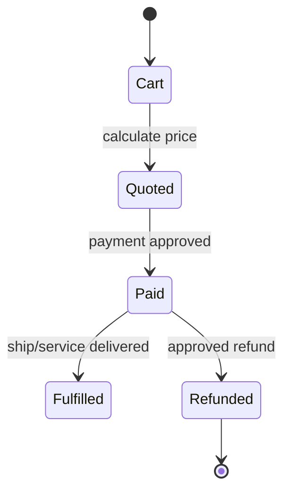
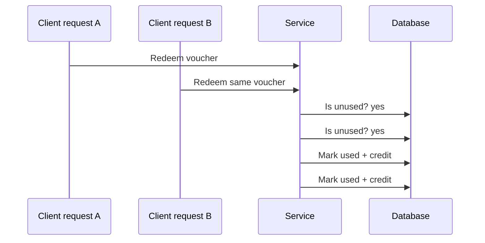

# Business Logic Testing

> [!abstract] Enterprise methodology
> Business-logic flaws arise when individually valid features can be sequenced, repeated, raced, or combined to violate a business invariant. They rarely have generic signatures; testers must understand the workflow, actors, assets, states, and economic consequences.

## Model the business state machine



Write invariants before testing:

```text
Inventory cannot become negative.
One voucher can reduce one eligible order once.
A refund cannot exceed settled payment.
Only the owner or delegated operator can alter the order.
State transitions must occur in order and be idempotent.
```

## Abuse-case categories

- Skipping required workflow stages.
- Replaying one-time actions.
- Changing price, quantity, currency, or entitlement after server calculation.
- Crossing tenant, account, or role boundaries.
- Racing concurrent requests against non-atomic state.
- Using stale approvals after revocation.
- Combining discounts, credits, refunds, and transfers unexpectedly.
- Exhausting finite resources such as reservations, invitations, or verification messages.

## Controlled examples

### Parameter trust

```http
POST /api/order HTTP/1.1
Content-Type: application/json

{"sku":"LAB-001","quantity":1,"unitPrice":0.01}
```

Expected: the server ignores client price and calculates from authoritative catalog data. Use a synthetic SKU and do not complete a real financial transaction.

### Replay and idempotency

```text
Request A: POST /api/refunds idempotency-key=test-42 → 201 Created
Request B: same key and body                       → 200 Existing result
Observed flaw:                                    → second refund created
```

### Race condition



Run concurrency only against test accounts and bounded values. The proof is duplicate canary credit, not financial loss.

## Role and tenant workflows

Create an explicit actor matrix:

| Action | Customer | Manager | Support | Administrator |
|---|---:|---:|---:|---:|
| View own order | Yes | Scoped | Support case | Yes |
| Refund | No | Limited | Case-bound | Yes |
| Export tenant | No | Own tenant | No | Controlled |

Test direct requests, not only UI visibility. Verify object ownership and function permission independently.

## Evidence and business impact

```text
Invariant: refund total <= settled payment
Test data: client-created order worth 10 test credits
Sequence: two concurrent refund approvals
Actual: two refunds of 10 credits accepted
Impact: financial loss and ledger inconsistency
Cleanup: test ledger entries reversed by client operator
```

Remediation often requires transactions, uniqueness constraints, idempotency keys, server-side recalculation, explicit state machines, and audit reconciliation—not a WAF rule.

---
> 🔼 Up: [[Web Application Penetration Testing]]
