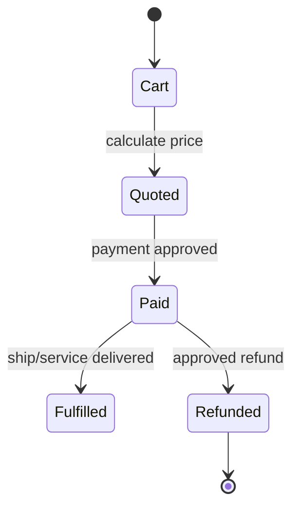
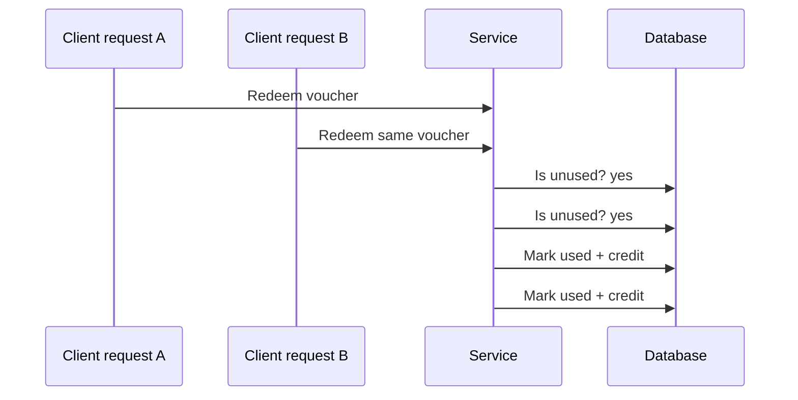
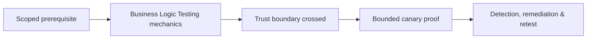

# Business Logic Testing

> [!abstract] Enterprise methodology
> Business-logic flaws arise when individually valid features can be sequenced, repeated, raced, or combined to violate a business invariant. They rarely have generic signatures; testers must understand the workflow, actors, assets, states, and economic consequences.

## Model the business state machine



Write invariants before testing:

```text
Inventory cannot become negative.
One voucher can reduce one eligible order once.
A refund cannot exceed settled payment.
Only the owner or delegated operator can alter the order.
State transitions must occur in order and be idempotent.
```

## Abuse-case categories

- Skipping required workflow stages.
- Replaying one-time actions.
- Changing price, quantity, currency, or entitlement after server calculation.
- Crossing tenant, account, or role boundaries.
- Racing concurrent requests against non-atomic state.
- Using stale approvals after revocation.
- Combining discounts, credits, refunds, and transfers unexpectedly.
- Exhausting finite resources such as reservations, invitations, or verification messages.

## Controlled examples

### Parameter trust

```http
POST /api/order HTTP/1.1
Content-Type: application/json

{"sku":"LAB-001","quantity":1,"unitPrice":0.01}
```

Expected: the server ignores client price and calculates from authoritative catalog data. Use a synthetic SKU and do not complete a real financial transaction.

### Replay and idempotency

```text
Request A: POST /api/refunds idempotency-key=test-42 → 201 Created
Request B: same key and body                       → 200 Existing result
Observed flaw:                                    → second refund created
```

### Race condition



Run concurrency only against test accounts and bounded values. The proof is duplicate canary credit, not financial loss.

## Role and tenant workflows

Create an explicit actor matrix:

| Action | Customer | Manager | Support | Administrator |
|---|---:|---:|---:|---:|
| View own order | Yes | Scoped | Support case | Yes |
| Refund | No | Limited | Case-bound | Yes |
| Export tenant | No | Own tenant | No | Controlled |

Test direct requests, not only UI visibility. Verify object ownership and function permission independently.

## Evidence and business impact

```text
Invariant: refund total <= settled payment
Test data: client-created order worth 10 test credits
Sequence: two concurrent refund approvals
Actual: two refunds of 10 credits accepted
Impact: financial loss and ledger inconsistency
Cleanup: test ledger entries reversed by client operator
```

Remediation often requires transactions, uniqueness constraints, idempotency keys, server-side recalculation, explicit state machines, and audit reconciliation—not a WAF rule.

## Invariants & abuse cases

Write security invariants before tests:

```text
Only an assigned approver may move Submitted -> Approved.
Inventory may never become negative.
A refund cannot exceed settled payment minus prior refunds.
An invitation is bound to tenant, email, role, expiry, and one-time use.
One idempotency key represents one operation and one authenticated principal.
```

Then derive abuse cases: skip states, reverse states, replay, mutate after approval, submit concurrently, use stale objects, cross tenant/role, alter sign/precision/currency, exceed quotas, and trigger asynchronous jobs out of order.

## Concurrency testing

Race tests require explicit authorization and canary state. Establish a baseline, synchronize a small number of requests, capture server request IDs and database-visible outcome, and stop before resource pressure.

```text
Two simultaneous redemption requests
Expected: one 200, one 409; balance decreases once
Observed: two 200; balance decreases twice
Evidence: request IDs, monotonic timestamps, canary account ledger
```

The remediation is usually transactional: unique constraints, compare-and-swap/version columns, row locks, idempotency records, and state validation inside the same transaction—not client-side disabling.

## Mastery lab

Model an order/refund/invitation system as state diagrams and invariants. Test role transitions, negative/overflow values, replay, stale tokens, and one two-request race. Produce one confirmed finding and one rejected hypothesis, each with business impact and root-cause remediation.

## Reporting quality

Describe violated business rule, prerequisites, exact state, bounded proof, financial/operational impact, audit visibility, and durable fix. Avoid naming a generic vulnerability class without explaining the process the attacker can subvert.

---
> 🔼 Up: [[Business Logic & Workflow Security]]

## Core Concept

**Business Logic Testing** is the atomic learning objective of this note. Identify its trust boundary, prerequisites, attacker-controlled input or state, vulnerable transformation, violated security invariant, minimum evidence, business consequence, and safe stopping point. The mechanism must remain explainable without depending on a specific product.

## Visual Attack Flow



## Practical Payloads & Execution

```http
POST /c2r-lab/business-logic-testing HTTP/1.1
Host: app.example.test
Authorization: Bearer <CANARY_IDENTITY>
Content-Type: application/json

{"object":"C2R-CANARY","test":true}
```

### Expected output

```text
HTTP/1.1 200 OK
X-C2R-Result: vulnerable-condition-observed
{"marker":"C2R-CANARY-PROOF"}
```

Treat the output as proof of only the stated condition. Repeat with a negative control, preserve timestamps and the affected build, and never expand impact merely because another path appears reachable.

## Real-World Scenario

A multi-tenant enterprise service exposes a scoped **Business Logic Testing** condition to a synthetic customer account. The assessor proves one trust-boundary failure with a canary object, correlates application and identity telemetry, removes test state, and assigns the authoritative server-side control.

The durable remediation belongs at the authoritative enforcement layer. Retest the original condition and meaningful variants while verifying legitimate workflows still function.
