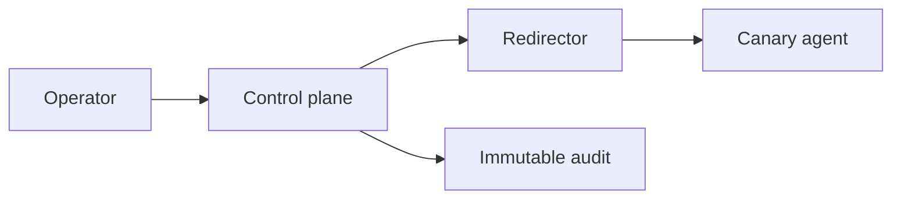

# C2 Infrastructure & Operational Security

## 🗺️ Zero-to-Mastery Learning Path

1. [[Command & Control Architecture]]
2. [[Redirectors, Domains & Traffic Governance]]
3. [[Red Team Operational Security & Teardown]]
4. [[Anti-Forensics Methodology]]

---
> 🔼 Up: [[Red Team Operations]]
