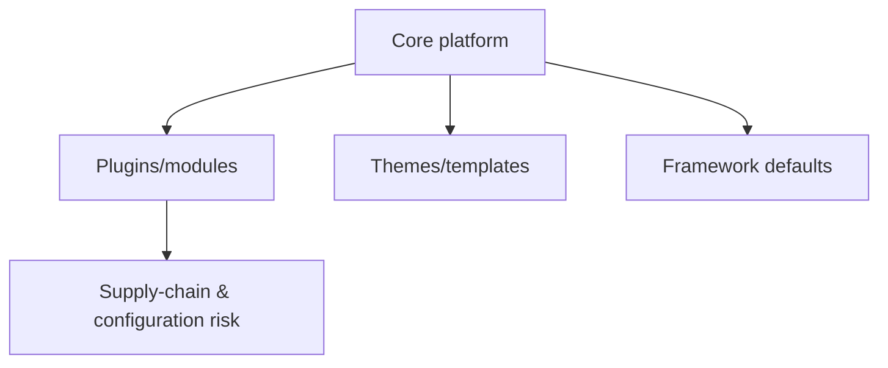

# CMS & Framework Security Testing

## 🗺️ Zero-to-Mastery Learning Path

1. [[WordPress Security Testing]]
2. [[Drupal Security Testing]]
3. [[Joomla Security Testing]]
4. [[Magento Security Testing]]
5. [[Laravel Security Testing]]
6. [[Spring Security Testing]]
7. [[Django Security Testing]]

---
> 🔼 Up: [[Web Application Penetration Testing]]
