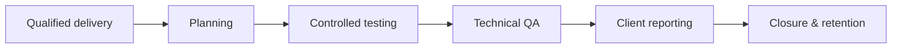

# CREST Penetration Testing Methodology

CREST-style professional testing emphasizes competent personnel, client communication, risk-controlled delivery, evidence quality, reproducibility, and actionable reporting. It is as much an assurance and governance model as a technical workflow.



## Delivery controls

Use named engagement leadership, competency matching, peer review, secure communications, encrypted evidence, daily status, issue escalation, safety monitoring, and report quality assurance. High-risk findings require prompt validated notification rather than waiting for final reporting.

## Quality gates

```text
[ ] scope and authorization verified
[ ] test plan and stop contacts acknowledged
[ ] credentials and evidence channels validated
[ ] finding independently reviewed
[ ] severity and business context reviewed
[ ] artifacts and cleanup reconciled
[ ] report technically and editorially QA'd
[ ] retention/deletion schedule initiated
```

## Mastery exercise

Design a QA process where another tester can reproduce findings without access to the original operator’s memory. Include evidence standards, severity arbitration, urgent-notification procedure, cleanup confirmation, and client acceptance.

---
> 🔼 Up: [[Methodologies & Frameworks]]

## Core Concept

**CREST Penetration Testing Methodology** is the atomic learning objective of this note. Identify its trust boundary, prerequisites, attacker-controlled input or state, vulnerable transformation, violated security invariant, minimum evidence, business consequence, and safe stopping point. The mechanism must remain explainable without depending on a specific product.

## Visual Attack Flow


## Practical Payloads & Execution

```text
engagement_action=CREST Penetration Testing Methodology
asset=C2R-CANARY
identity=authorized-test-principal
impact_ceiling=single synthetic proof
```

### Expected output

```text
expected_output=C2R_CANARY_PROOF
cleanup=verified
retest_condition=recorded
```

Treat the output as proof of only the stated condition. Repeat with a negative control, preserve timestamps and the affected build, and never expand impact merely because another path appears reachable.

## Real-World Scenario

A regulated enterprise assessment applies **CREST Penetration Testing Methodology** to a canary asset. Scope, evidence provenance, decision points, control outcomes, cleanup, ownership, and retest criteria are recorded so another qualified operator can reproduce the conclusion.

The durable remediation belongs at the authoritative enforcement layer. Retest the original condition and meaningful variants while verifying legitimate workflows still function.
