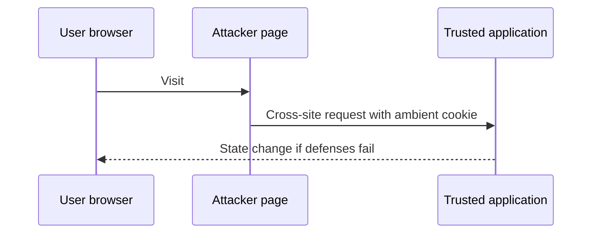
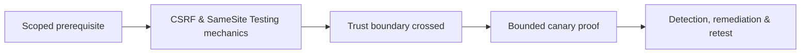

# CSRF & SameSite Testing

CSRF abuses ambient browser authority to perform a state-changing request without user intent.



Identify state-changing endpoints, authentication mechanism, method/content type, anti-CSRF token binding, Origin/Referer validation, cookie SameSite/Secure scope, CORS interaction, and user confirmation. SameSite Lax, Strict, and None differ across top-level navigation, methods, subdomains, and browser behavior.

Use canary accounts/actions. A proof can change a test preference and immediately revert it. Test token omission, reuse, cross-session use, method override, simple content types, and sibling-subdomain trust.

Remediate with unpredictable session-bound tokens, Origin checks, appropriate SameSite cookies, reauthentication for sensitive actions, and no state changes via safe methods. Mastery lab: compare token-only, SameSite-only, and layered defenses across a controlled cross-site fixture.

---
> 🔼 Up: [[Client-Side Web Security]]

## Core Concept

**CSRF & SameSite Testing** is the atomic learning objective of this note. Identify its trust boundary, prerequisites, attacker-controlled input or state, vulnerable transformation, violated security invariant, minimum evidence, business consequence, and safe stopping point. The mechanism must remain explainable without depending on a specific product.

## Visual Attack Flow



## Practical Payloads & Execution

```http
POST /c2r-lab/csrf-samesite-testing HTTP/1.1
Host: app.example.test
Authorization: Bearer <CANARY_IDENTITY>
Content-Type: application/json

{"object":"C2R-CANARY","test":true}
```

### Expected output

```text
HTTP/1.1 200 OK
X-C2R-Result: vulnerable-condition-observed
{"marker":"C2R-CANARY-PROOF"}
```

Treat the output as proof of only the stated condition. Repeat with a negative control, preserve timestamps and the affected build, and never expand impact merely because another path appears reachable.

## Real-World Scenario

A multi-tenant enterprise service exposes a scoped **CSRF & SameSite Testing** condition to a synthetic customer account. The assessor proves one trust-boundary failure with a canary object, correlates application and identity telemetry, removes test state, and assigns the authoritative server-side control.

The durable remediation belongs at the authoritative enforcement layer. Retest the original condition and meaningful variants while verifying legitimate workflows still function.
