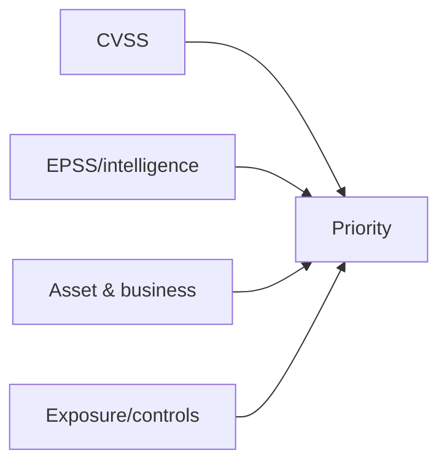
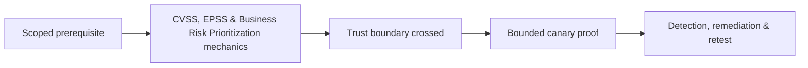

# CVSS, EPSS & Business Risk Prioritization

Prioritization combines technical severity, exploitation likelihood, exposure, asset criticality, data, control strength, attack-path position, and remediation urgency.



Document CVSS vector, scoring assumptions, EPSS timestamp, known exploitation, reachability, prerequisites, blast radius, compensating controls, and owner. DREAD may support workshops but should not replace evidence-based risk governance.

Mastery lab: prioritize ten findings, explain disagreements between CVSS and business priority, and define SLA plus retest for each tier.

## Use the models for different questions

CVSS describes technical severity under stated metric assumptions. EPSS estimates the probability that a published vulnerability will be exploited in the wild over its model horizon. Neither knows the organization’s asset criticality, exposure, compensating controls, data sensitivity, recovery capability, or regulatory impact.

```text
Priority = technical impact × exploit likelihood × business exposure
           adjusted by control strength, asset role, and remediation urgency
```

Record the CVSS vector, version, rationale, and environmental changes rather than only a number. Record EPSS date because model outputs change. Add whether exploitation was manually verified, reachable from the relevant trust zone, exposed to untrusted users, present on a crown-jewel path, or already detected. A lower-scoring authorization flaw affecting every tenant may outrank a high base score isolated behind strong controls. Risk acceptance identifies owner, rationale, compensating control, expiration, and review trigger.

---
> 🔼 Up: [[Reporting & Purple Teaming]]

## Core Concept

**CVSS, EPSS & Business Risk Prioritization** is the atomic learning objective of this note. Identify its trust boundary, prerequisites, attacker-controlled input or state, vulnerable transformation, violated security invariant, minimum evidence, business consequence, and safe stopping point. The mechanism must remain explainable without depending on a specific product.

## Visual Attack Flow



## Practical Payloads & Execution

```text
engagement_action=CVSS, EPSS & Business Risk Prioritization
asset=C2R-CANARY
identity=authorized-test-principal
impact_ceiling=single synthetic proof
```

### Expected output

```text
expected_output=C2R_CANARY_PROOF
cleanup=verified
retest_condition=recorded
```

Treat the output as proof of only the stated condition. Repeat with a negative control, preserve timestamps and the affected build, and never expand impact merely because another path appears reachable.

## Real-World Scenario

A regulated enterprise assessment applies **CVSS, EPSS & Business Risk Prioritization** to a canary asset. Scope, evidence provenance, decision points, control outcomes, cleanup, ownership, and retest criteria are recorded so another qualified operator can reproduce the conclusion.

The durable remediation belongs at the authoritative enforcement layer. Retest the original condition and meaningful variants while verifying legitimate workflows still function.
