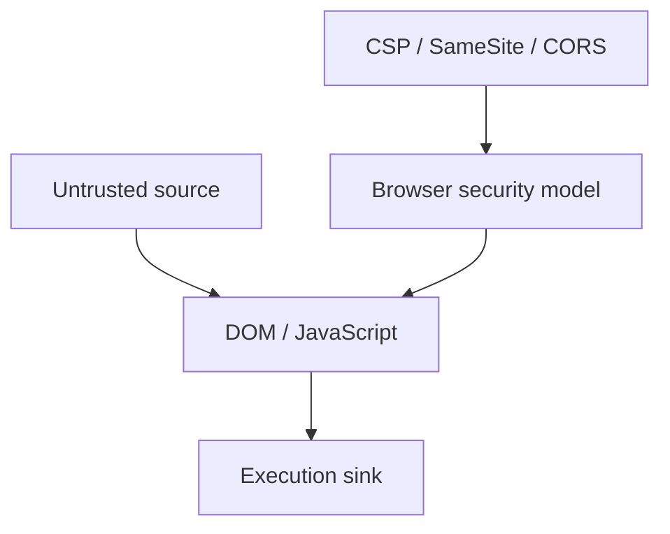

# Client-Side Web Security

Browser security depends on origins, execution contexts, DOM sinks, cookies, navigation, framing, storage, and cross-origin policy.

## 🗺️ Zero-to-Mastery Learning Path

1. [[Cross-Site Scripting]]
2. [[CSRF & SameSite Testing]]
3. [[CORS Misconfiguration]]
4. [[Clickjacking]]
5. [[Prototype Pollution & DOM Security]]

---
> 🔼 Up: [[Web Application Penetration Testing]]
