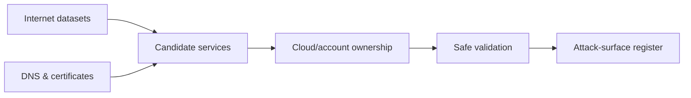
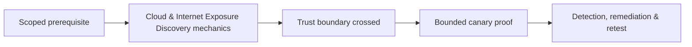

# Cloud & Internet Exposure Discovery

Exposure discovery correlates Internet observations with cloud accounts, certificates, DNS, storage, edge services, SaaS, and business ownership. It is not indiscriminate scanning.



Assess public addresses, load balancers, gateways, object storage, registries, serverless endpoints, identity tenants, remote access, management consoles, and abandoned resources. Internet search engines offer historical and current observations; validate directly at approved rates.

Ownership evidence may include cloud resource tags, billing/account records, DNS control, certificate issuance, known ranges, and application-team confirmation. Shared providers, CDN edges, and managed SaaS complicate attribution.

```text
endpoint: api-old.example.test
edge: managed gateway
certificate: client-controlled
backend ownership: unconfirmed
exposure: TLS service reachable
decision: hold testing until service owner confirms backend scope
```

Mastery lab: reconcile a synthetic cloud inventory with DNS and Internet observations, identify shadow/abandoned assets, classify confidence, and produce owner-assigned remediation without touching third-party infrastructure.

---
> 🔼 Up: [[Reconnaissance & Attack Surface]]

## Core Concept

**Cloud & Internet Exposure Discovery** is the atomic learning objective of this note. Identify its trust boundary, prerequisites, attacker-controlled input or state, vulnerable transformation, violated security invariant, minimum evidence, business consequence, and safe stopping point. The mechanism must remain explainable without depending on a specific product.

## Visual Attack Flow



## Practical Payloads & Execution

```text
target=198.51.100.20 or designated enterprise canary
identity=assessment-user
action=Cloud & Internet Exposure Discovery
rate_and_scope=approved
```

### Expected output

```text
observable_result=C2R_CANARY_PROOF
unauthorized_targets=0
evidence_timestamp=recorded
```

Treat the output as proof of only the stated condition. Repeat with a negative control, preserve timestamps and the affected build, and never expand impact merely because another path appears reachable.

## Real-World Scenario

A scoped enterprise infrastructure assessment applies **Cloud & Internet Exposure Discovery** only to documentation-range addresses and designated canary services. Activity is rate-limited, ownership is verified, protocol evidence is captured, and broad exploitation is explicitly avoided.

The durable remediation belongs at the authoritative enforcement layer. Retest the original condition and meaningful variants while verifying legitimate workflows still function.
