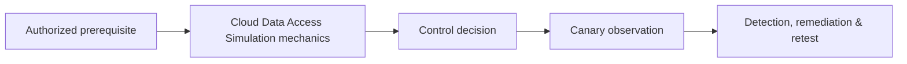

# Cloud Data Access Simulation

> [!warning] Authorized simulation only
> Apply this material only to scoped systems, synthetic identities, canary data, and reversible laboratory fixtures.

## Core Concept

**Cloud Data Access Simulation** is one atomic competency within **Cloud Red Team Operations**. Learn the underlying mechanism before any product syntax: prerequisites, trust boundary, controllable state, security invariant, bounded evidence, business impact, and safe stopping point.

## Visual Attack Flow



## Practical Payloads & Execution

```text
objective=Cloud Data Access Simulation
identity=authorized-canary
asset=C2R-LAB
action=exercise one atomic condition
impact_ceiling=one synthetic proof
```

### Expected output

```text
result=C2R_CANARY_PROOF
telemetry=timestamped and correlated
unauthorized_scope=0
cleanup=verified
```

Record the negative control and secure expected result. Commands and product manuals belong in Tooling; this note focuses on mechanics, interpretation, evidence, and control design.

## Real-World Scenario

An enterprise assessment isolates **Cloud Data Access Simulation** on a designated canary asset. The operator demonstrates the minimum observable condition, correlates identity, endpoint, application, network, or control-plane evidence as applicable, and stops before collecting real secrets or affecting production availability.

Remediation is applied at the authoritative enforcement layer and retested against the original condition, adjacent variants, legacy paths, and legitimate workflows.

## Crook2Root Mastery Checklist

- Explain the mechanism and prerequisites without naming a tool.
- Produce a bounded practical proof and expected output.
- Identify prevention, detection, response, and recovery controls.
- Preserve evidence and remove every engagement artifact.
- Define a durable regression and retest condition.

---
> 🔼 Up: [[Cloud Red Team Operations]]
