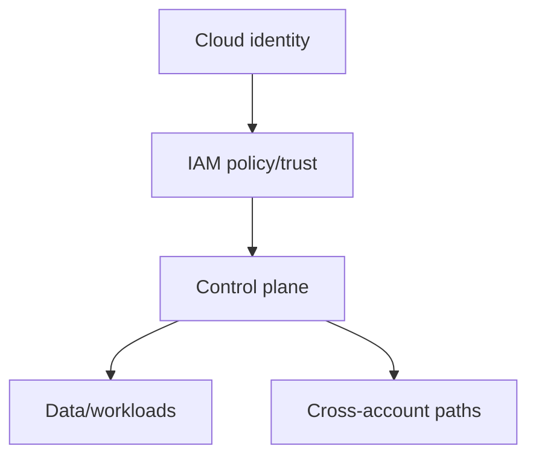

# Cloud Red Team Operations

## 🗺️ Zero-to-Mastery Learning Path

1. [[Cloud Identity Operations]]
2. [[Cloud Control Plane Operations]]
3. [[Cloud Persistence Simulation]]
4. [[Cloud Data Access Simulation]]

---
> 🔼 Up: [[Red Team Operations]]
