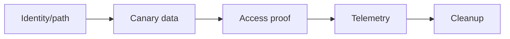
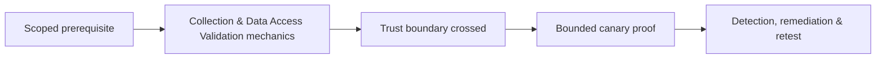

# Collection & Data Access Validation

Collection testing proves access to business data without copying unnecessary production information.



Define crown jewels, canary records, allowed queries, byte/record limits, prohibited data, encryption, staging, transfer, and deletion. Sources include file shares, databases, email, document platforms, object storage, backups, and application exports.

```text
proof: read metadata + client canary record C2R-0042
records accessed: 1
bytes retained: 842
production personal data: none
```

Validate access controls, DLP, audit, alerting, and owner response. Mastery lab: design a canary dataset and prove access through one path while demonstrating a blocked adjacent path.

---
> 🔼 Up: [[Post-Exploitation & Persistence]]

## Core Concept

**Collection & Data Access Validation** is the atomic learning objective of this note. Identify its trust boundary, prerequisites, attacker-controlled input or state, vulnerable transformation, violated security invariant, minimum evidence, business consequence, and safe stopping point. The mechanism must remain explainable without depending on a specific product.

## Visual Attack Flow



## Practical Payloads & Execution

```text
fixture=Collection & Data Access Validation
build=instrumented-debug
action=trigger minimized canary input
impact_ceiling=fixed marker or deterministic crash
```

### Expected output

```text
result=C2R_CANARY_PROOF
mitigation_state=recorded
production_boundary_crossed=false
```

Treat the output as proof of only the stated condition. Repeat with a negative control, preserve timestamps and the affected build, and never expand impact merely because another path appears reachable.

## Real-World Scenario

A vendor-owned instrumented build reproduces **Collection & Data Access Validation**. The researcher demonstrates only a fixed marker or deterministic crash, records architecture and mitigation assumptions, patches the root defect, and retains the minimized input as a regression test.

The durable remediation belongs at the authoritative enforcement layer. Retest the original condition and meaningful variants while verifying legitimate workflows still function.
