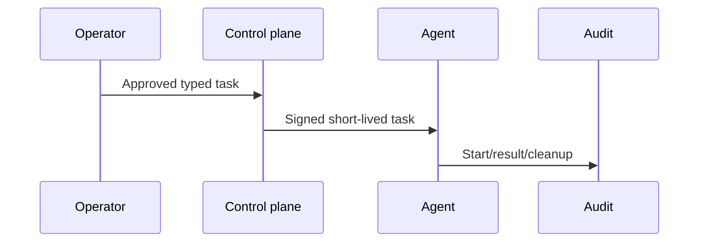
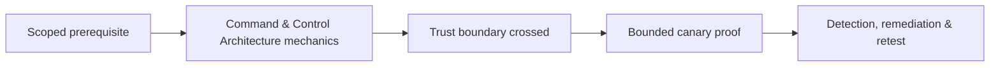

# Command & Control Architecture

Authorized C2 coordinates signed, allowlisted actions through operator identity, policy, task queues, canary agents, artifact storage, and immutable audit.



Compare polling, push, HTTP(S), DNS, cloud queue, and peer models by reliability, auditability, detection, and safety—not concealment. Framework manuals belong in Tooling. Mastery lab: build a transparent emulator with RBAC, expiry, kill switch, and cleanup.

## Control-plane engineering

Separate operator authentication, authorization policy, task creation, transport, agent execution, result storage, and audit. A task should carry operation ID, target identity, typed action, expiry, nonce, maximum runtime, output classification, and signature. Agents reject unknown targets, expired tasks, invalid signatures, or actions beyond their local policy.

```json
{"operation":"RT-014","target":"canary-07","action":"collect-host-metadata","expires":"2026-07-30T15:10:00Z","max_seconds":20}
```

Polling tolerates intermittent connectivity and creates regular network patterns; push reduces latency but requires reachable listeners; queues offer durable delivery but introduce provider identity and audit dependencies. DNS has severe payload and reliability constraints and should be emulated only where approved. Design for key rotation, operator separation of duties, replay prevention, bounded output, backpressure, health telemetry, and emergency revocation. Preserve server and agent audit independently so operators cannot silently rewrite history. Teardown tests are part of architecture: expired tasks stop, agents uninstall, credentials revoke, and the control plane becomes unreachable without leaving orphaned resources.

---
> 🔼 Up: [[C2 Infrastructure & Operational Security]]

## Core Concept

**Command & Control Architecture** is the atomic learning objective of this note. Identify its trust boundary, prerequisites, attacker-controlled input or state, vulnerable transformation, violated security invariant, minimum evidence, business consequence, and safe stopping point. The mechanism must remain explainable without depending on a specific product.

## Visual Attack Flow



## Practical Payloads & Execution

```text
operation_action=Command & Control Architecture
asset=C2R-CANARY
expiry=15 minutes
impact_ceiling=one synthetic proof
```

### Expected output

```text
objective=C2R_CANARY_PROOF
telemetry=correlated
cleanup=verified
```

Treat the output as proof of only the stated condition. Repeat with a negative control, preserve timestamps and the affected build, and never expand impact merely because another path appears reachable.

## Real-World Scenario

A threat-informed red-team exercise performs **Command & Control Architecture** on registered infrastructure and disposable assets. The action has an expiry, kill switch, impact ceiling, and telemetry objective; the team stops at proof and reconciles every artifact during teardown.

The durable remediation belongs at the authoritative enforcement layer. Retest the original condition and meaningful variants while verifying legitimate workflows still function.
