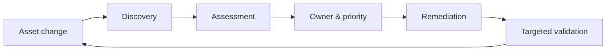
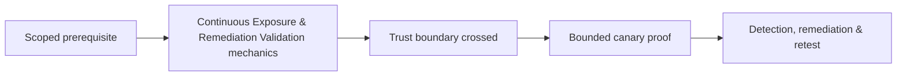

# Continuous Exposure & Remediation Validation

Continuous exposure management joins asset change, vulnerability intelligence, control validation, ownership, remediation, and retesting. It is not continuous uncontrolled penetration testing.



Define coverage by asset class, credential success, scan freshness, owner assignment, and validation quality. Deduplicate by root cause and affected control rather than opening one ticket per endpoint. Retest the original proof and adjacent variants; configuration changes can partially fix symptoms.

```text
Finding: public storage policy allows anonymous listing
Fix claim: bucket made private
Retest: anonymous list denied; direct known-object read denied; CDN cache purged
Telemetry: denied requests logged
Status: closed with evidence
```

Metrics include unknown assets, coverage, credential success, confirmed ratio, age by risk, ownerless findings, recurrence, retest failure, and mean time to validated remediation. Mastery lab: design a monthly exposure cycle and show how emergency intelligence changes priorities without bypassing safety review.

---
> 🔼 Up: [[Vulnerability Assessment]]

## Core Concept

**Continuous Exposure & Remediation Validation** is the atomic learning objective of this note. Identify its trust boundary, prerequisites, attacker-controlled input or state, vulnerable transformation, violated security invariant, minimum evidence, business consequence, and safe stopping point. The mechanism must remain explainable without depending on a specific product.

## Visual Attack Flow



## Practical Payloads & Execution

```text
target=198.51.100.20 or designated enterprise canary
identity=assessment-user
action=Continuous Exposure & Remediation Validation
rate_and_scope=approved
```

### Expected output

```text
observable_result=C2R_CANARY_PROOF
unauthorized_targets=0
evidence_timestamp=recorded
```

Treat the output as proof of only the stated condition. Repeat with a negative control, preserve timestamps and the affected build, and never expand impact merely because another path appears reachable.

## Real-World Scenario

A scoped enterprise infrastructure assessment applies **Continuous Exposure & Remediation Validation** only to documentation-range addresses and designated canary services. Activity is rate-limited, ownership is verified, protocol evidence is captured, and broad exploitation is explicitly avoided.

The durable remediation belongs at the authoritative enforcement layer. Retest the original condition and meaningful variants while verifying legitimate workflows still function.
