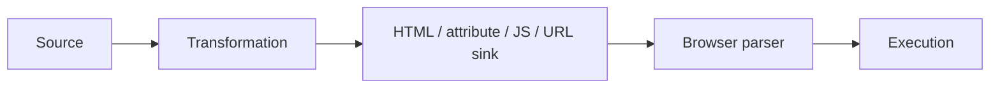
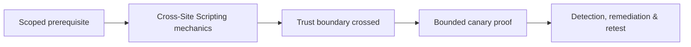

# Cross-Site Scripting

XSS executes attacker-influenced script in another user’s origin. Classify reflected, stored, DOM-based, and mutation behavior by source, transformation, sink, context, and affected identity.



Use a benign canary such as setting a test DOM attribute; do not steal cookies or perform actions. Context determines encoding: HTML text, quoted attributes, JavaScript strings, CSS, and URLs require different controls. DOM XSS may never reach the server.

Test CSP as defense-in-depth: nonce/hash policy, unsafe directives, script gadgets, base URI, object restrictions, reporting, and trusted-types adoption. WAF evasion is not remediation.

```text
source: location.hash
transform: decodeURIComponent
sink: element.innerHTML
proof: test element receives data-c2r="executed"
```

Remediate with context-aware output encoding, safe DOM APIs, sanitization for intended HTML, CSP, Trusted Types, and avoiding dangerous sinks. Mastery lab: trace and fix reflected, stored, DOM, and mutation fixtures.

---
> 🔼 Up: [[Client-Side Web Security]]

## Core Concept

**Cross-Site Scripting** is the atomic learning objective of this note. Identify its trust boundary, prerequisites, attacker-controlled input or state, vulnerable transformation, violated security invariant, minimum evidence, business consequence, and safe stopping point. The mechanism must remain explainable without depending on a specific product.

## Visual Attack Flow



## Practical Payloads & Execution

```http
POST /c2r-lab/cross-site-scripting HTTP/1.1
Host: app.example.test
Authorization: Bearer <CANARY_IDENTITY>
Content-Type: application/json

{"object":"C2R-CANARY","test":true}
```

### Expected output

```text
HTTP/1.1 200 OK
X-C2R-Result: vulnerable-condition-observed
{"marker":"C2R-CANARY-PROOF"}
```

Treat the output as proof of only the stated condition. Repeat with a negative control, preserve timestamps and the affected build, and never expand impact merely because another path appears reachable.

## Real-World Scenario

A multi-tenant enterprise service exposes a scoped **Cross-Site Scripting** condition to a synthetic customer account. The assessor proves one trust-boundary failure with a canary object, correlates application and identity telemetry, removes test state, and assigns the authoritative server-side control.

The durable remediation belongs at the authoritative enforcement layer. Retest the original condition and meaningful variants while verifying legitimate workflows still function.
