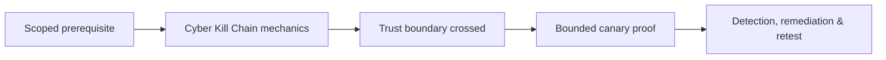

Inspired by the military kill chains, the Cyber Kill Chain is a cyber security framework introduced by Lockheed Martin in 2011. It is created to help organisations defend against cyber attacks by understanding how they are conducted. The Cyber Kill Chain divides an attack into seven stages:
1. **Reconnaissance**: In the first stage, the attacker gathers information about the target
2. **Weaponisation**: Once proper reconnaissance is conducted, the attacker creates a deliverable payload or modifies an existing one based on the target system’s vulnerabilities
3. **Delivery**: Once ready, the attacker sends the weaponised payload to the target
4. **Exploitation**: Once executed, the payload exploits a vulnerability in the target’s system
5. **Installation**: The exploitation enables the attacker to install a backdoor or malware to maintain persistence in the target’s environment
6. **Command & Control (C2)**: Using the installed backdoor, the attacker can control the compromised system
7. **Actions on Objectives**: Reaching this far, the attacker can now carry out further actions such as data exfiltration or other systems’ exploitation

![[lab_5f04259cf9bf5b57aed2c476-1745943727167.svg]]

Reconnaissance has its origins in the military and refers to the act of gathering information about a target. In cyber security, this stage collects information about the target’s vulnerabilities and weaknesses to discover potential entry points.

Reconnaissance can be divided into two types: passive and active. When carrying out **passive reconnaissance**, the attacker performs their activities without making any “noise,” for example, using open-source intelligence (OSINT). However, in the case of **active reconnaissance**, the attacker cannot remain completely quiet and invisible; it requires some form of interaction with the target organisation, such as using social engineering against the target’s personnel or scanning a target system for vulnerabilities.

## Reconnaissance: Examples

There are many examples of what an attacker might do in the reconnaissance phase.

**Passive Reconnaissance**

Let’s consider a few examples of passive reconnaissance. The first examples that come to mind are the WHOIS and DNS databases. The WHOIS database can reveal contact information, registration dates, and domain owners unless hidden using a privacy service add-on. Querying the DNS database can reveal the DNS servers and public servers’ IP addresses. Other examples of passive reconnaissance include website reconnaissance by crawling and scraping, social media reconnaissance, and Google Dorking, i.e., using search engines to reveal sensitive information and confidential files.

**Active Reconnaissance**

As already mentioned, active reconnaissance can get noisy. One typical example is network port scanning, which identifies live hosts and running services. More intrusive examples include vulnerability scanning to identify weaknesses in the target’s public services. Furthermore, physical reconnaissance is typical, where the attacker might visit the target’s premises to identify entry points, study the security measures, and observe personnel behaviour.

## Countermeasures Against Reconnaissance: Examples

Defence tactics include minimising public information exposure. This countermeasure is achieved by limiting the information on websites, social media accounts, and DNS records. Furthermore, the WHOIS records should not reveal any names or addresses that are best left private; many registrars offer a privacy service, usually for an added cost.

Monitoring and analysing network traffic and logs is a must to detect vulnerabilities and network port scans. The security team must monitor the network traffic actively to detect scanning traffic. Checking the service logs is also necessary to uncover reconnaissance attempts.

![[lab_5f04259cf9bf5b57aed2c476-1745943824279.svg]]

Once enough information has been gathered about the target, the attacker proceeds to the next stage, weaponisation. Based on the information the attacker has gathered about the target systems, they can create a payload tailored to exploit the discovered weaknesses. The attacker might use a ready-made exploit, edit an existing one, or create one from scratch. We should note that various frameworks and toolkits can help them in this stage.

Many attackers resort to the use of obfuscation or encryption to evade detection. Furthermore, they might hide it in an innocuous-looking file, such as an MS Word or a PDF file. The critical thing to note is that at the end of this stage, a deliverable malicious file will be ready to be delivered to the target system.

## Weaponisation: Examples

After the reconnaissance phase, the attacker has identified the vulnerabilities to target. They must use the proper exploit code to create their “cyber weapon.” What can the cyber attacker weaponise? Everything, from an email attachment to a USB.

Attackers might use one of the available exploit kits. An exploit kit is an automated platform containing various exploits for various vulnerabilities. These platforms make it easy for attackers to package the exploit code within a payload, such as an executable file or specific documents.

Thankfully, not all documents can be weaponised to carry exploit code. Attackers usually rely on creating Microsoft Office documents with malicious macros. If macros are enabled, a macro executes a saved set of instructions when the document is opened.

Once the malicious file is ready, the attacker might craft a phishing email with a malicious attachment, set up a web page to host it or save it on a USB memory drive. On the other hand, if the attacker wants to target a vulnerable service, the attacker needs to plan how to deliver the payload to the vulnerable service in the next phase.

## Countermeasures Against Weaponisation: Examples

On the defender’s side, user training is indispensable. When a user receives an email, they need to be careful if it contains any attachments; moreover, they should know how to inspect the email source to check its legitimacy. Furthermore, if the email includes an encrypted zip file of the payload and the decryption password, the user should suspect such email instructions before rushing to satisfy their curiosity. User cyber security training is a continuous process and an indispensable piece of any solid defence.

In addition to user training, it is reasonable to disable any unnecessary features, uninstall unnecessary software, and remove unnecessary browser plugins. It is crucial to restrict potentially risky features, such as disabling macros in Office documents or limiting them to signed and trusted sources. Such policies can be enforced via Windows group policy, which helps reduce the potential attack surface.

![[lab_5f04259cf9bf5b57aed2c476-1745943858065.svg]]  

In the previous stage, the attacker prepared a tailored payload, and now, they need to find a suitable way to transmit it to the target environment. They can pick an appropriate delivery method using the information gathered from reconnaissance.

## Delivery: Examples

Attackers keep getting creative for the successful delivery of their exploit payload.

- **Phishing emails**: These emails usually contain malicious attachments but might use links to malicious downloads. File names play a significant role in this attack; `invoice.pdf.exe` might trick the target user, unlike `program.exe`.
- **Spear phishing emails** refer to a targeted attack where the emails are crafted to resemble legitimate communication from a source known or trusted by the recipient. For example, the sender’s name and email address are spoofed to appear as the recipient’s manager.
- **Malicious web links**: The attacker might host the exploit kits on public websites. Domain spoofing and URL shortening are also used to make the links appear less suspicious.
- **File-sharing platforms**: Attackers might upload malicious files to file-sharing web services, relying on people’s familiarity with the providers.
- **Malvertising**: The attackers show advertisements on legitimate websites to redirect users to the malicious page.
- **SMS Phishing (Smishing)**: The attacker sends text messages with malicious links or instructions to download malware.
- **Social engineering**: The attacker might convince an unsuspecting user to download and run a malicious program.
- **Physical means of delivery**: The malicious code might be saved on a USB flash memory and left in an accessible location. Another example is mailing an innocuous-looking DVD containing the malicious program. The attacker must always provide a convincing context, such as the DVD containing a catalogue of interest to the target personnel.

Many other tactics exist, and new ones are expected to emerge as new technologies become available and attackers become more sophisticated with time.

## Countermeasures Against Delivery: Examples

It is like a cyber arms race where the defence team must work against every delivery method they are aware of. The list starts with user training in cyber security awareness. The users are educated about safe browsing practices, phishing, and social engineering attacks. Going beyond user training, email and web filtering are the standard in many organisations. Web application firewalls (WAFs) are indispensable in blocking malicious files available via the web. Moreover, network monitoring and patch management become increasingly vital in large corporations. Many other defence tactics exist to break the attack chain and prevent the successful delivery of the malicious payload.

![[lab_5f04259cf9bf5b57aed2c476-1745943933428.svg]]  

Following the successful delivery of the malicious payload comes the exploitation stage. Exploitation can take various forms, such as a software vulnerability, a weak password, or a system misconfiguration.

## Exploitation: Examples

The attacker might use various ways to exploit a system. The most straightforward approach is targeting a password-based authentication system. If the password is a default or weak password, it is easy for the attacker to discover; alternatively, the attacker can use phishing or more sophisticated techniques to trick the user into submitting their password.

Software vulnerabilities present another door for attackers. Vulnerabilities cover both client systems and network services. New vulnerabilities are discovered regularly, and it is usually only a matter of time before attackers develop working exploit code. Sometimes, an exploit is made available before the vendor becomes aware that a vulnerability exists in their product; in this case, it is called a zero-day exploit.

There are many other vulnerabilities that could be exploited, ranging from SQL injection to buffer overflow. Depending on the specific vulnerability, this can create an easy entry even for someone without login credentials.

## Countermeasures Against Exploitation: Examples

The security team can use many solutions to disrupt exploitation. We will list a few. Password requirements should be enforced, and multi-factor authentication (MFA) should be required to harden password-based authentication. MFA prevents an attacker from achieving any gain, even with a valid set of login credentials.

Patch management for servers and clients is a must to eradicate known vulnerabilities. Furthermore, vulnerability scanning is necessary to discover any vulnerabilities left unpatched.

Intrusion Prevention Systems (IPSs) can play a significant role in blocking various exploitation attempts by inspecting the traffic for known exploits. Web Application Firewalls (WAFs) can block a variety of attacks against web applications, such as SQL injection, cross-site scripting (XSS), and cross-site request forgery (CSRF).

![[lab_5f04259cf9bf5b57aed2c476-1745943985465.svg]]

Following the successful exploitation of a target system, the installation phase ensures persistent access to the exploited system. Consequently, the attacker can return to the exploited system later without going through the exploitation phase again. The keyword here is persistence.

## Installation: Examples

Regardless of the approach used, persistent access must be guaranteed in the future; otherwise, the attacker cannot continue to later phases. To maintain persistent access, sometimes creating scheduled tasks in MS Windows or setting a cron job in Linux systems is necessary. Other times, they need to modify startup scripts or configuration files. Installing a new service in Windows or a daemon in Linux systems is one possible approach. The service approach makes it easier to maintain persistent access.

Attackers might resort to installing malware, creating backdoors, or installing rootkits, among other things. Furthermore, they try to take advantage of the system’s built-in functions, such as legitimate Windows tools and binaries, also known as living-off-the-land binaries (LOLBins).

In some cases, the attackers need to download and execute additional payloads to fortify their access. For example, they might deploy a web shell after exploiting a web application. A web shell is a small script written in a programming language that is supported by the exploited server; it allows the attacker to execute operating system commands on the target via a web browser interface. Running a web shell over a standard protocol such as HTTPS will ensure they can log in to their target system while camouflaging their activity within HTTPS traffic.

## Countermeasures Against Installation: Examples

It is essential to monitor new processes and services; analysing the parent process and associated activities to detect malicious ones based on full context is required.

Endpoint Detection and Response (EDR) allows monitoring endpoints for suspicious activities, such as unusual process creation, file modification in sensitive directories, and unexpected network connections.

Regular system audits and comparisons against a secure baseline are necessary to identify unauthorised changes, such as newly created user accounts or newly installed services, and revert them to their original state. Some configuration management tools help automate this process to maintain secure systems and revert unauthorised changes.

Another approach is application allowlisting, which prevents the execution of unauthorised or malicious software by allowing only approved applications to run. The approaches we mentioned so far are not exhaustive; however, they give you an idea of the complexity of the countermeasures. If the attacker successfully executes the installation phase, they can proceed to set a covert channel in the next phase.

![[lab_5f04259cf9bf5b57aed2c476-1745944031768.svg]]

Following a successful installation of persistent access within the target environment, the attacker needs to maintain reliable and discreet access to the compromised systems so that they can later act on their objectives. The Command and Control (C2) phase aims to establish this covert communication channel for use in the next phase. In this phase, the attacker sets up the C2 communication channel between the compromised systems and their own infrastructure.

Attackers can use various techniques to create such infrastructure as domain names, IP addresses, and cloud services. To evade detection, the attacker might resort to different methods; examples include creating random domain names and frequently changing the IP address. In some cases, the attackers might use a seemingly legitimate domain so as not to raise suspicions. It is also common to use encryption, among other types of obfuscation techniques, to avoid getting discovered.

## Command and Control: Examples

We will list a few tactics employed by C2 infrastructure to achieve resilient covert communication. The first tactic is using common application layer protocols such as HTTP, HTTPS, DNS, and SMTP for C2 communication, which allows blending in with legitimate traffic. Furthermore, C2 infrastructure may use encrypted channels such as HTTPS to hide from network monitoring tools. It is also possible to use DNS tunnelling, i.e., encoding data within DNS requests, to bypass various security solutions and firewalls.

Regarding domain addresses, C2 communication can use social media platforms, such as X direct messages, to send commands to a botnet. Another option is using legitimate cloud services, such as Dropbox and Google Docs, especially for data exfiltration.

If the attacker registers their own domain name and uses it to establish the C2 infrastructure, it will be too easy to take it down. Therefore, the C2 relies on various techniques to ensure resilient communications. Examples include Domain Registration Algorithms (DGAs) and Fast Flux. **DGA** refers to creating a vast number of domain names, for example, 50 000, using a predefined algorithm. The owner of the C2 infrastructure registers only 1% or 2%. The malware, in turn, will iterate over this extensive list till it finds an active one. If the domain gets blocked or seized, the malware switches to the next active one.

**Fast Flux** associates hundreds or thousands of IP addresses with a single domain name; furthermore, these IP addresses are swapped every few minutes. Compromised devices, e.g., IoTdevices, act as proxies to forward traffic to the hidden C2 server. If any IP address, i.e., proxy node, gets blocked, the malware automatically switches to the following IP address.

## Countermeasures against Command and Control: Examples

The cyber security team must consider various solutions to detect and disrupt C2 traffic. Let’s explore a few.

Network monitoring via firewalls, IDS, and IPS plays a significant role in detecting and blocking C2 traffic. It is essential to watch for unusual traffic patterns and volumes and connections to known malicious IP addresses.

Because DNS traffic can be used to tunnel C2 traffic, monitoring DNS traffic and analysing DNS queries is equally vital, especially when stumbling across unusually long ones or detecting high volumes of requests to suspicious domains. Moreover, because web shells use HTTP and HTTPS protocols, monitoring web traffic helps detect suspicious connections, while content filtering can block access to suspicious URLs. Furthermore, encryption inspection would be necessary to decrypt and inspect encrypted traffic to detect C2 communication using HTTPS.

Many security teams go a step further and deploy honeypots to detect and analyse C2 communication attempts and monitor attacker behaviour. The list goes on, and we leave a more detailed dive into countermeasures to other rooms.

![[lab_5f04259cf9bf5b57aed2c476-1745944093554.svg]]

After establishing a covert C2 communication channel, the attacker can carry out their original goals. In this phase, the attacker executes their original goals, which range from data exfiltration (information theft) to service disruption.

## Actions on Objectives: Examples

The attackers might be targeting an organisation for a variety of reasons. Some attacks are blaring. For example, if the attacker is only interested in seeking damage, they can launch a destructive attack by deleting or corrupting data to disrupt normal system operations. On the other hand, attackers might be after financial gain and “quick riches”, usually by carrying out a ransomware attack. Or they might be trying to get rich more discreetly, such as financial theft via unauthorised wire transfers or other fraudulent transactions.

In a covert attack, such as industrial and political espionage, the attackers would be most interested in stealing sensitive files from their target, commonly called data exfiltration. Alternatively, if the attacker is interested in getting access to other systems on the target network, they will try to stealthily compromise other systems on the network, i.e., lateral movement.

Depending on the target organisation, the threat actor might be interested in manipulating Industrial Control Systems (ICSs). It is also equally plausible that this is preceded by establishing a long-term persistent presence so that they carry out their attack at a time of their choosing. The execution depends on the threat actor and their motives. We mentioned a few examples, but the list can get much longer.

## Countermeasures Against Actions on Objectives: Examples

Let’s explore a few countermeasures that an organisation can consider. Data Loss Prevention (DLP) solutions can play a key role in preventing unauthorised data exfiltration. Furthermore, establishing a reliable backup and recovery plan is indispensable to mitigate ransomware and other destructive attacks.

To minimise the damage an attacker can cause, an organisation needs to consider network segmentation and strict access controls. Network segmentation isolates critical systems in the case of a compromised system on another segment and prevents the attacker from moving laterally; moreover, access controls and the principle of least privilege limit who can access sensitive systems and data.

User activity monitoring helps detect suspicious behaviours; for example, you would not expect your users to be sending DNS queries after midnight. On the other hand, Endpoint Detection and Response (EDR) solutions offer an excellent choice for monitoring and detecting suspicious activities on endpoints, such as processes attempting to access or modify sensitive data, encrypt files, or establish unauthorised network connections.

---
> 🔼 Up: [[Methodologies & Frameworks]]

## Core Concept

**Cyber Kill Chain** is the atomic learning objective of this note. Identify its trust boundary, prerequisites, attacker-controlled input or state, vulnerable transformation, violated security invariant, minimum evidence, business consequence, and safe stopping point. The mechanism must remain explainable without depending on a specific product.

## Visual Attack Flow



## Practical Payloads & Execution

```text
engagement_action=Cyber Kill Chain
asset=C2R-CANARY
identity=authorized-test-principal
impact_ceiling=single synthetic proof
```

### Expected output

```text
expected_output=C2R_CANARY_PROOF
cleanup=verified
retest_condition=recorded
```

Treat the output as proof of only the stated condition. Repeat with a negative control, preserve timestamps and the affected build, and never expand impact merely because another path appears reachable.

## Real-World Scenario

A regulated enterprise assessment applies **Cyber Kill Chain** to a canary asset. Scope, evidence provenance, decision points, control outcomes, cleanup, ownership, and retest criteria are recorded so another qualified operator can reproduce the conclusion.

The durable remediation belongs at the authoritative enforcement layer. Retest the original condition and meaningful variants while verifying legitimate workflows still function.
