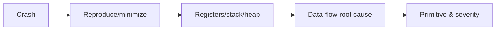
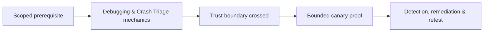

# Debugging & Crash Triage

Crash triage determines reproducibility, faulting instruction, exception/signal, corrupted state, input offset, root cause, security primitive, and exploitability.



Collect exact binary/build ID, symbols, input, environment, command, sanitizer output, dump/core, modules, registers, stack, memory map, and thread state. Distinguish read/write/execute faults, null dereferences, assertions, stack exhaustion, races, and intentional termination.

```shell-session
(gdb) info registers rip rsp rbp
rip 0x4141414141414141
rsp 0x7fffffffe110
(gdb) bt
#0  0x4141414141414141 in ?? ()
```

Practice only on owned fixtures. Mastery lab: minimize three crashes and classify non-exploitable denial, controlled write, and control-flow corruption.

## Repeatable triage procedure

First preserve the original artifact, hash, input, arguments, environment, and dump. Reproduce under the same build, then remove irrelevant input while keeping the failure. Establish whether the fault is deterministic, data-dependent, timing-dependent, or resource-dependent.

At the fault, identify instruction semantics, accessed address, controlling input bytes, register provenance, current thread, other-thread state, stack integrity, heap state, and memory mapping. Walk backward to the first violated invariant; the final crash may be far from the original overwrite or free.

```text
classification: write AV at controlled destination
root cause: unchecked decoded length
primitive: 4-byte write, constrained value
constraints: authenticated parser, 64-bit build, ASLR enabled
```

Score exploitability conservatively. Null dereference, assertion, stack exhaustion, and read fault can still create denial of service but do not automatically imply code execution. Compare sanitizer, optimized, and hardened builds. Close with a root-cause patch, minimized regression, affected-version analysis, and operational guidance for crash telemetry and emergency mitigation.

---
> 🔼 Up: [[Vulnerability Discovery & Debugging]]

## Core Concept

**Debugging & Crash Triage** is the atomic learning objective of this note. Identify its trust boundary, prerequisites, attacker-controlled input or state, vulnerable transformation, violated security invariant, minimum evidence, business consequence, and safe stopping point. The mechanism must remain explainable without depending on a specific product.

## Visual Attack Flow



## Practical Payloads & Execution

```text
target=198.51.100.20 or designated enterprise canary
identity=assessment-user
action=Debugging & Crash Triage
rate_and_scope=approved
```

### Expected output

```text
observable_result=C2R_CANARY_PROOF
unauthorized_targets=0
evidence_timestamp=recorded
```

Treat the output as proof of only the stated condition. Repeat with a negative control, preserve timestamps and the affected build, and never expand impact merely because another path appears reachable.

## Real-World Scenario

A scoped enterprise infrastructure assessment applies **Debugging & Crash Triage** only to documentation-range addresses and designated canary services. Activity is rate-limited, ownership is verified, protocol evidence is captured, and broad exploitation is explicitly avoided.

The durable remediation belongs at the authoritative enforcement layer. Retest the original condition and meaningful variants while verifying legitimate workflows still function.
