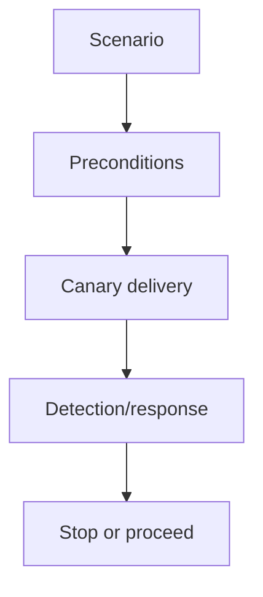
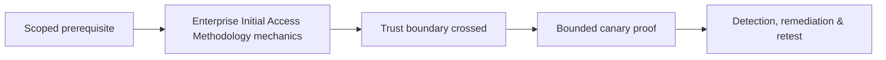

# Enterprise Initial Access Methodology

Initial access scenarios include exposed applications, supplied credentials, approved phishing, partner trust, remote access, cloud identities, and physical delivery simulations.



Define target cohort, canary payload, delivery, user safety, credential handling, endpoint behavior, callback infrastructure, and immediate revoke/cleanup. Never use real malware or uncontrolled credential harvesting. Success is a measured control outcome, not merely execution.

## Scenario selection and gates

Choose an initial-access path from the threat model and enterprise architecture: an internet-facing application, federated identity, trusted supplier, remote-access service, approved message, exposed cloud workload, or physical handoff. Document the assumption being tested and require a gate before moving from delivery to execution and from execution to lateral operations.

```text
Hypothesis: a compromised contractor identity can reach a managed endpoint
Canary: dedicated contractor account + disposable workstation
Gate 1: identity sign-in observed by white cell
Gate 2: endpoint callback permitted only after safety approval
Stop: unexpected tenant, real secret, instability, or third-party system
```

The payload should be inert, signed where possible, uniquely attributable, time-limited, and remotely revocable. Capture prevention and detection at DNS, email, identity, proxy, endpoint, and SOC layers. Distinguish a delivered lure from a usable foothold and a foothold from durable access. Cleanup includes revoking sessions, credentials, consent grants, files, mail rules, cloud resources, domains, and certificates. The final narrative explains why the path was plausible, which controls succeeded, and the earliest durable control that should break it.

---
> 🔼 Up: [[Red Team Planning & Initial Access]]

## Core Concept

**Enterprise Initial Access Methodology** is the atomic learning objective of this note. Identify its trust boundary, prerequisites, attacker-controlled input or state, vulnerable transformation, violated security invariant, minimum evidence, business consequence, and safe stopping point. The mechanism must remain explainable without depending on a specific product.

## Visual Attack Flow



## Practical Payloads & Execution

```text
operation_action=Enterprise Initial Access Methodology
asset=C2R-CANARY
expiry=15 minutes
impact_ceiling=one synthetic proof
```

### Expected output

```text
objective=C2R_CANARY_PROOF
telemetry=correlated
cleanup=verified
```

Treat the output as proof of only the stated condition. Repeat with a negative control, preserve timestamps and the affected build, and never expand impact merely because another path appears reachable.

## Real-World Scenario

A threat-informed red-team exercise performs **Enterprise Initial Access Methodology** on registered infrastructure and disposable assets. The action has an expiry, kill switch, impact ceiling, and telemetry objective; the team stops at proof and reconciles every artifact during teardown.

The durable remediation belongs at the authoritative enforcement layer. Retest the original condition and meaningful variants while verifying legitimate workflows still function.
