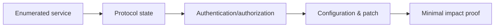
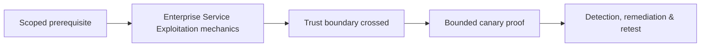

# Enterprise Service Exploitation

Service exploitation validates insecure protocol configuration, trust, authentication, authorization, patching, and dangerous features across enterprise services.



Coverage includes SMB/Samba, RDP, SSH, FTP, SMTP/IMAP, databases, caches, message brokers, RPC, remote management, backup services, and appliances. Historical vulnerabilities such as EternalBlue, SMBGhost, BlueKeep, Exchange chains, or database command features should be studied through prerequisites and patched lab fixtures—not blindly attempted.

```text
Service: Redis on internal interface
Observation: unauthenticated commands accepted
Safe proof: read/write canary key only
Prohibited: cron/SSH-key writes, module loading, production data access
Impact: unauthorized modification and likely execution path
```

For each service document state machine, identities, encryption, dangerous methods, data boundary, logging, and safe proof. Mastery lab: assess one Windows file service, one database, one mail service, and one remote-management service using only canary assets.

---
> 🔼 Up: [[Network Penetration Testing]]

## Core Concept

**Enterprise Service Exploitation** is the atomic learning objective of this note. Identify its trust boundary, prerequisites, attacker-controlled input or state, vulnerable transformation, violated security invariant, minimum evidence, business consequence, and safe stopping point. The mechanism must remain explainable without depending on a specific product.

## Visual Attack Flow



## Practical Payloads & Execution

```text
target=198.51.100.20 or designated enterprise canary
identity=assessment-user
action=Enterprise Service Exploitation
rate_and_scope=approved
```

### Expected output

```text
observable_result=C2R_CANARY_PROOF
unauthorized_targets=0
evidence_timestamp=recorded
```

Treat the output as proof of only the stated condition. Repeat with a negative control, preserve timestamps and the affected build, and never expand impact merely because another path appears reachable.

## Real-World Scenario

A scoped enterprise infrastructure assessment applies **Enterprise Service Exploitation** only to documentation-range addresses and designated canary services. Activity is rate-limited, ownership is verified, protocol evidence is captured, and broad exploitation is explicitly avoided.

The durable remediation belongs at the authoritative enforcement layer. Retest the original condition and meaningful variants while verifying legitimate workflows still function.
