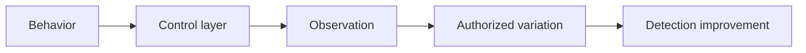

# Evasion & Endpoint Tradecraft

## 🗺️ Zero-to-Mastery Learning Path

1. [[Antivirus Testing Principles]]
2. [[EDR Testing Principles]]
3. [[AMSI Testing Principles]]
4. [[ETW Testing Principles]]
5. [[Payload Engineering & Obfuscation Principles]]
6. [[Process Injection Theory]]
7. [[System Call Security Theory]]

---
> 🔼 Up: [[Red Team Operations]]
