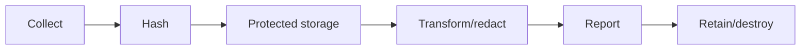
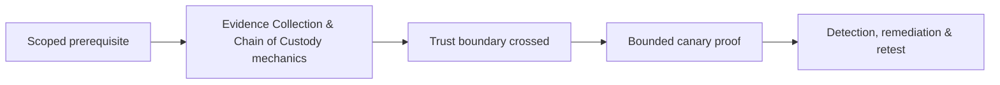

# Evidence Collection & Chain of Custody

Evidence must be sufficient, minimal, reproducible, protected, and traceable.



Record UTC time, operator, source, method, target, request/event IDs, original hash, location, classification, access, transformations, and disposition. Preserve raw originals and create working copies.

```shell-session
analyst@lab:~$ sha256sum F-04-response.txt
82c1...  F-04-response.txt
```

Minimize credentials and personal data; redact only copies. Mastery lab: build an evidence register, transfer package, verification procedure, and deletion certificate.

## Evidence lifecycle

Define an evidence identifier, source, collector, UTC collection time, acquisition method, original hash, working-copy hash, classification, storage location, access list, retention, and destruction date. Preserve the original read-only and analyze a verified copy. Screenshots support context but should not replace raw requests, logs, configuration exports, or packet evidence.

```text
ID: E-EXT-014-003
Source: api.example.test / request retest-017-03
Collected: 2026-07-30T12:44:19Z by operator-02
SHA-256: <recorded digest>
Class: Confidential / synthetic data only
Transfer: encrypted case vault; receipt verified
```

Every handoff records sender, recipient, time, purpose, and integrity verification. Redact reports from a copy so the source artifact remains reproducible. Clock drift, missing build identifiers, copy-and-paste transformations, and unrecorded analyst edits weaken evidence. At closure, retain only what contract, law, and remediation require; destroy temporary extracts and keys with an auditable record.

---
> 🔼 Up: [[Reporting & Purple Teaming]]

## Core Concept

**Evidence Collection & Chain of Custody** is the atomic learning objective of this note. Identify its trust boundary, prerequisites, attacker-controlled input or state, vulnerable transformation, violated security invariant, minimum evidence, business consequence, and safe stopping point. The mechanism must remain explainable without depending on a specific product.

## Visual Attack Flow



## Practical Payloads & Execution

```text
engagement_action=Evidence Collection & Chain of Custody
asset=C2R-CANARY
identity=authorized-test-principal
impact_ceiling=single synthetic proof
```

### Expected output

```text
expected_output=C2R_CANARY_PROOF
cleanup=verified
retest_condition=recorded
```

Treat the output as proof of only the stated condition. Repeat with a negative control, preserve timestamps and the affected build, and never expand impact merely because another path appears reachable.

## Real-World Scenario

A regulated enterprise assessment applies **Evidence Collection & Chain of Custody** to a canary asset. Scope, evidence provenance, decision points, control outcomes, cleanup, ownership, and retest criteria are recorded so another qualified operator can reproduce the conclusion.

The durable remediation belongs at the authoritative enforcement layer. Retest the original condition and meaningful variants while verifying legitimate workflows still function.
