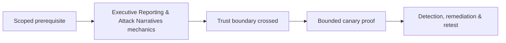

# Executive Reporting & Attack Narratives

Executive reporting explains exposure, attack paths, business consequences, systemic causes, and prioritized decisions without unnecessary payload detail.


Include objectives, scope/limitations, overall posture, key paths, themes, immediate actions, strategic improvements, and residual risk. Use verified language: “demonstrated,” “observed,” “inferred,” and “not tested.”

One narrative should show how several medium findings combine into material impact. Avoid averaging severity or counting findings as posture. Mastery lab: produce one-page executive summary and attack-path diagram from a technical evidence set.

## Translating technical evidence

Executives need the tested objective, material exposure, control pattern, affected business capability, plausible consequence, and prioritized decisions. Do not turn every technical finding into a separate executive theme. Group issues into root causes such as fragmented identity governance, inconsistent authorization, weak segmentation, or incomplete telemetry.


An attack narrative is chronological and evidence-backed: initial condition, decisions, controls that worked, controls that failed, achieved privilege, bounded proof, detection response, and cleanup. Include prevented paths to recognize effective investment. Provide a 30/60/90-day roadmap with accountable owners and dependencies. Avoid sensational language, unexplained acronyms, and claims beyond demonstrated reach.

---
> 🔼 Up: [[Reporting & Purple Teaming]]

## Core Concept

**Executive Reporting & Attack Narratives** is the atomic learning objective of this note. Identify its trust boundary, prerequisites, attacker-controlled input or state, vulnerable transformation, violated security invariant, minimum evidence, business consequence, and safe stopping point. The mechanism must remain explainable without depending on a specific product.

## Visual Attack Flow



## Practical Payloads & Execution

```text
engagement_action=Executive Reporting & Attack Narratives
asset=C2R-CANARY
identity=authorized-test-principal
impact_ceiling=single synthetic proof
```

### Expected output

```text
expected_output=C2R_CANARY_PROOF
cleanup=verified
retest_condition=recorded
```

Treat the output as proof of only the stated condition. Repeat with a negative control, preserve timestamps and the affected build, and never expand impact merely because another path appears reachable.

## Real-World Scenario

A regulated enterprise assessment applies **Executive Reporting & Attack Narratives** to a canary asset. Scope, evidence provenance, decision points, control outcomes, cleanup, ownership, and retest criteria are recorded so another qualified operator can reproduce the conclusion.

The durable remediation belongs at the authoritative enforcement layer. Retest the original condition and meaningful variants while verifying legitimate workflows still function.
