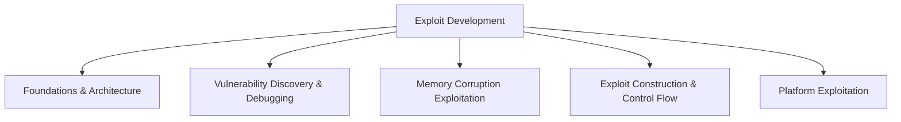

# Exploit Development

> [!abstract] Major pillar of [[Offensive Security]]
> The science of turning software defects into controlled execution: memory models, corruption primitives, debugging, shellcode, mitigations, return-oriented programming, exploit reliability, and the defensive telemetry produced by each stage. Practice only on owned or deliberately vulnerable laboratory binaries.

## 🗺️ Zero-to-Mastery Learning Path

1. [[Exploit Foundations & Architecture]]
2. [[Vulnerability Discovery & Debugging]]
3. [[Memory Corruption Exploitation]]
4. [[Exploit Construction & Control Flow]]
5. [[Platform Exploitation]]

---
> 🔼 Up: [[Offensive Security]]
