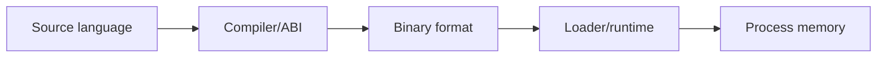

# Exploit Foundations & Architecture

## 🗺️ Zero-to-Mastery Learning Path

1. [[CPU Architecture]]
2. [[Assembly Language for Exploit Development]]
3. [[Application Binary Interfaces]]
4. [[Binary Exploitation Fundamentals]]
5. [[ELF Internals]]
6. [[PE Internals]]
7. [[Mach-O Internals]]

---
> 🔼 Up: [[Exploit Development]]
