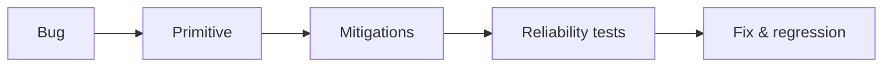
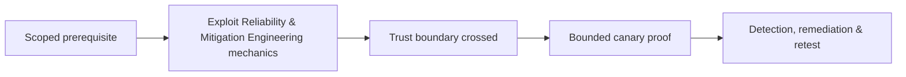

# Exploit Reliability & Mitigation Engineering

Reliability depends on version, architecture, allocator/layout, concurrency, network, environment, mitigations, and cleanup. Security engineering asks whether a defect is consistently reachable and how controls reduce primitive quality.



Analyze NX/DEP, ASLR, PIE, canaries, RELRO, CFG/CFI, CET/shadow stack, PAC, sandboxing, hardened allocators, privilege separation, and memory-safe rewrites. Run repeated fixtures and classify success, clean failure, crash, and corruption.

Mastery lab: evaluate one defect across compiler hardening combinations, measure outcomes, patch root cause, and add regression plus defense telemetry.

## Reliability matrix

Test across supported versions, architectures, optimization levels, allocators, input sizes, thread counts, environment settings, and mitigation combinations. Run enough repetitions to distinguish deterministic behavior from heap or scheduler luck. Classify outcomes as expected rejection, clean process termination, recoverable crash, uncontrolled corruption, primitive obtained, or canary objective reached.

```text
build        runs  reject  crash  primitive  canary
baseline      100       0     12         88      81
ASLR+canary   100       0    100          0       0
patched       100     100      0          0       0
```

Mitigations compose but can have bypass assumptions, compatibility modes, and partial deployment. Confirm actual runtime policy rather than compiler flags alone. The final engineering decision considers reachable attack surface, primitive quality, reliability, privilege, sandbox boundaries, and detection. Root-cause repair plus regression testing is the closure standard; hardening and telemetry provide defense in depth.

---
> 🔼 Up: [[Exploit Construction & Control Flow]]

## Core Concept

**Exploit Reliability & Mitigation Engineering** is the atomic learning objective of this note. Identify its trust boundary, prerequisites, attacker-controlled input or state, vulnerable transformation, violated security invariant, minimum evidence, business consequence, and safe stopping point. The mechanism must remain explainable without depending on a specific product.

## Visual Attack Flow



## Practical Payloads & Execution

```text
fixture=Exploit Reliability & Mitigation Engineering
build=instrumented-debug
action=trigger minimized canary input
impact_ceiling=fixed marker or deterministic crash
```

### Expected output

```text
result=C2R_CANARY_PROOF
mitigation_state=recorded
production_boundary_crossed=false
```

Treat the output as proof of only the stated condition. Repeat with a negative control, preserve timestamps and the affected build, and never expand impact merely because another path appears reachable.

## Real-World Scenario

A vendor-owned instrumented build reproduces **Exploit Reliability & Mitigation Engineering**. The researcher demonstrates only a fixed marker or deterministic crash, records architecture and mitigation assumptions, patches the root defect, and retains the minimized input as a regression test.

The durable remediation belongs at the authoritative enforcement layer. Retest the original condition and meaningful variants while verifying legitimate workflows still function.
