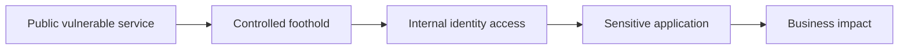

# External Network Pentesting

> [!abstract] Enterprise methodology
> An external assessment models an internet-based attacker with no trusted access. It validates asset ownership, perimeter exposure, remote-management controls, identity entry points, patch/configuration state, segmentation, monitoring, and the business impact of a controlled foothold.

> [!danger] Authorization
> Cloud/CDN ownership, shared hosting, managed-service providers, denial-of-service risk, credential testing, and exploitation boundaries must be explicit. Stop immediately if traffic reaches a third party or excluded asset.

## Engagement architecture


## Phase 1 — scope and ownership

Build an immutable list of domains, ranges, cloud tenants, known public services, exclusions, and third parties. For every candidate address record:

```text
Asset: vpn.example.com
Observed address: 192.0.2.18
Ownership evidence: certificate + client inventory
Provider: managed edge service
Scope status: application hostname in scope; provider control plane excluded
Testing window: 22:00–04:00 UTC
```

An IP in a client DNS record is not automatically client-owned. Validate before probing.

## Phase 2 — exposure mapping

Map externally reachable transport endpoints, protocols, virtual hosts, certificates, mail gateways, remote access, name services, and management interfaces. Compare the discovered surface with the client inventory.

High-value categories:

- VPN, SSO, federation, password-reset, and remote-desktop gateways.
- Email, DNS, file transfer, and externally exposed administration.
- Web/API endpoints, alternate ports, forgotten test systems, and origin exposure.
- Vendor appliances and end-of-life edge devices.
- Cloud storage, load balancers, and publicly routable workloads.

Representative evidence:

```text
192.0.2.18:443  TLS certificate: vpn.example.com
HTTP response: 302 → /auth/login
Authentication: federated identity + MFA
Observation: management API not externally reachable
Confidence: high
```

## Phase 3 — service and trust validation

Enumerate protocol dialects, encryption, authentication, anonymous behavior, and exposed resources. Distinguish an old-looking banner from an actually vulnerable vendor build. Test identity controls using client-provided accounts and approved failure thresholds.

External trust questions:

- Does the edge enforce the same policy on alternate hostnames and ports?
- Can an origin be reached directly, bypassing the intended edge control?
- Are administration services restricted to management networks?
- Do password recovery and enrollment resist account enumeration?
- Are TLS identity, mail policy, DNS delegation, and third-party dependencies correct?

## Phase 4 — vulnerability verification

Prioritize by exposed capability and business consequence. Use the least-impact proof:

```text
Claim: obsolete VPN component is remotely vulnerable
Verification chain:
  1. Confirm exact vendor build through authenticated status page
  2. Confirm affected module enabled
  3. Reproduce benign behavior in matching lab appliance
  4. In production, prove only version/configuration condition
Decision: no production code-execution proof required
```

## Phase 5 — controlled foothold and segmentation

If exploitation is authorized, use a synthetic account, canary file, or controlled callback. Immediately document:

- Initial process and privilege.
- Network zone and reachable services.
- Credentials/tokens intentionally provisioned for testing.
- Data visible without broad collection.
- Cleanup actions and detection timestamps.

Do not convert a perimeter proof into unrestricted internal testing unless the scope explicitly allows it.

## Edge-control validation

Test consistency rather than claiming "bypass" from one unusual response. Compare:

| Path | Expected control | Evidence |
|---|---|---|
| Public hostname | CDN/WAF policy | Request ID and edge headers |
| Direct origin | Denied or restricted | Connection/result |
| Alternate hostname | Same authentication | Response comparison |
| IPv6 address | Same filtering as IPv4 | Reachability comparison |
| Alternate port | No shadow admin service | Service matrix |

## Reporting

Separate findings from attack-path observations. One externally exposed weakness may combine with weak identity recovery and flat segmentation into a critical path even when each item alone scores lower.



Retest from the same external vantage, with the same hostname/SNI and request conditions. Confirm both the root-cause fix and absence of equivalent alternate paths.

---
> 🔼 Up: [[Network Penetration Testing]]
