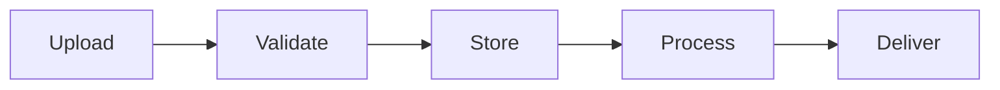
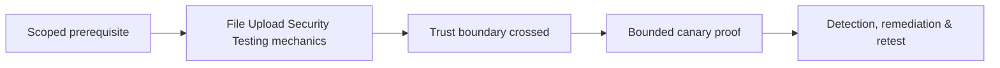

# File Upload Security Testing

Uploads cross filename, metadata, content, parser, storage, retrieval, transformation, and execution boundaries.



Test extension/MIME/magic consistency, polyglots, parser behavior, filename traversal/control characters, overwrites, archive extraction, SVG/HTML active content, image/document processing, storage permissions, random server names, download headers, quotas, malware workflow, and deletion.

Use benign canary files and parser fixtures. A proof can show active HTML is served under application origin without executing harmful script.

Remediate with allowlisted formats, content re-encoding where appropriate, server-generated names, isolated non-executable storage, safe parsers, size/decompression limits, attachment delivery, scanning, and lifecycle controls. Mastery lab: build an upload pipeline and test each boundary independently.

---
> 🔼 Up: [[File, Parser & Serialization Security]]

## Core Concept

**File Upload Security Testing** is the atomic learning objective of this note. Identify its trust boundary, prerequisites, attacker-controlled input or state, vulnerable transformation, violated security invariant, minimum evidence, business consequence, and safe stopping point. The mechanism must remain explainable without depending on a specific product.

## Visual Attack Flow



## Practical Payloads & Execution

```http
POST /c2r-lab/file-upload-security-testing HTTP/1.1
Host: app.example.test
Authorization: Bearer <CANARY_IDENTITY>
Content-Type: application/json

{"object":"C2R-CANARY","test":true}
```

### Expected output

```text
HTTP/1.1 200 OK
X-C2R-Result: vulnerable-condition-observed
{"marker":"C2R-CANARY-PROOF"}
```

Treat the output as proof of only the stated condition. Repeat with a negative control, preserve timestamps and the affected build, and never expand impact merely because another path appears reachable.

## Real-World Scenario

A multi-tenant enterprise service exposes a scoped **File Upload Security Testing** condition to a synthetic customer account. The assessor proves one trust-boundary failure with a canary object, correlates application and identity telemetry, removes test state, and assigns the authoritative server-side control.

The durable remediation belongs at the authoritative enforcement layer. Retest the original condition and meaningful variants while verifying legitimate workflows still function.
