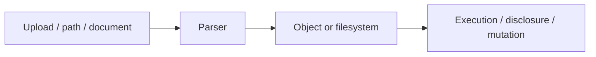

# File, Parser & Serialization Security

## 🗺️ Zero-to-Mastery Learning Path

1. [[Path Traversal]]
2. [[Local File Inclusion]]
3. [[Remote File Inclusion]]
4. [[File Upload Security Testing]]
5. [[XML External Entity Testing]]
6. [[Insecure Deserialization Testing]]

---
> 🔼 Up: [[Web Application Penetration Testing]]
