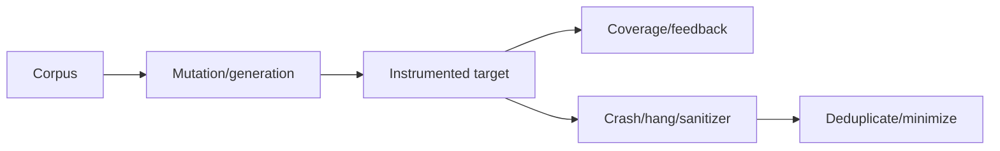
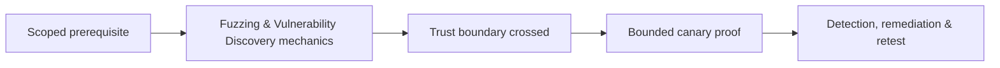

# Fuzzing & Vulnerability Discovery

Fuzzing generates or mutates inputs, measures execution feedback, detects failures, and minimizes unique cases.



Cover black-box, coverage-guided, grammar-aware, structure-aware, differential, stateful/network, and property fuzzing. Harness quality determines reachability: remove nondeterminism, reset state, cap resources, seed valid structures, and make failures observable.

```text
execs: 1,048,576 | edges: 8,421 | corpus: 412 | crashes: 3 unique | hangs: 1
```

Use sanitizers and isolated workers. Mastery lab: write a parser harness, improve coverage with dictionary/grammar, minimize crashes, and convert each root cause into a regression test.

## Campaign engineering

Choose a target boundary and success signal. A good harness initializes only necessary state, feeds one input, makes failures observable, resets cleanly, and avoids network, disk, time, or randomness unless those behaviors are the subject. Seed the corpus with small valid structures and add dictionaries or grammars for tokens that unlock deeper states.

Track executions per second, stable edge coverage, corpus growth, timeouts, sanitizer findings, memory usage, and unique root causes. Deduplicate first by stable stack or sanitizer signature, then by minimized input and code path; raw crash count is misleading. Treat hangs separately and enforce resource limits.

```text
triage: reproduce 10/10 → minimize 4 KB to 37 bytes
root cause: length arithmetic before allocation
action: fix checked multiplication + add corpus seed + regression
```

For stateful protocols, model message sequences and reset server state between cases. Differential fuzzing compares implementations; property fuzzing asserts invariants. Run workers in disposable, least-privilege environments because malformed inputs can trigger unexpected behavior.

---
> 🔼 Up: [[Vulnerability Discovery & Debugging]]

## Core Concept

**Fuzzing & Vulnerability Discovery** is the atomic learning objective of this note. Identify its trust boundary, prerequisites, attacker-controlled input or state, vulnerable transformation, violated security invariant, minimum evidence, business consequence, and safe stopping point. The mechanism must remain explainable without depending on a specific product.

## Visual Attack Flow



## Practical Payloads & Execution

```text
target=198.51.100.20 or designated enterprise canary
identity=assessment-user
action=Fuzzing & Vulnerability Discovery
rate_and_scope=approved
```

### Expected output

```text
observable_result=C2R_CANARY_PROOF
unauthorized_targets=0
evidence_timestamp=recorded
```

Treat the output as proof of only the stated condition. Repeat with a negative control, preserve timestamps and the affected build, and never expand impact merely because another path appears reachable.

## Real-World Scenario

A scoped enterprise infrastructure assessment applies **Fuzzing & Vulnerability Discovery** only to documentation-range addresses and designated canary services. Activity is rate-limited, ownership is verified, protocol evidence is captured, and broad exploitation is explicitly avoided.

The durable remediation belongs at the authoritative enforcement layer. Retest the original condition and meaningful variants while verifying legitimate workflows still function.
