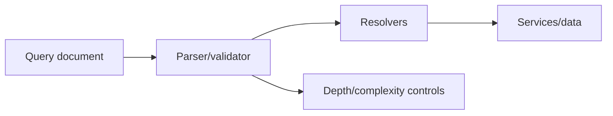
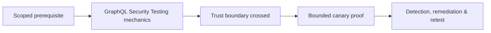

# GraphQL Security Testing

GraphQL exposes a typed graph through queries, mutations, subscriptions, resolvers, and often batching.



Test introspection exposure, field/object authorization, aliases, fragments, batching, nested/circular relationships, query depth/complexity, pagination, mutation input binding, subscriptions, error leakage, persisted queries, and resolver-level injection. A schema-hidden field may still be queryable.

```graphql
query Canary { invoice(id:"A-42") { id tenantId amount } }
```

Run with tenant A and B identities. Remediate with resolver authorization, schema-aware input validation, depth/complexity/cost and rate controls, bounded pagination, safe errors, and persisted-query governance. Mastery lab: build a role-field matrix and demonstrate one N+1 resource issue without causing load.

---
> 🔼 Up: [[API & Modern Protocol Testing]]

## Core Concept

**GraphQL Security Testing** is the atomic learning objective of this note. Identify its trust boundary, prerequisites, attacker-controlled input or state, vulnerable transformation, violated security invariant, minimum evidence, business consequence, and safe stopping point. The mechanism must remain explainable without depending on a specific product.

## Visual Attack Flow



## Practical Payloads & Execution

```http
POST /c2r-lab/graphql-security-testing HTTP/1.1
Host: app.example.test
Authorization: Bearer <CANARY_IDENTITY>
Content-Type: application/json

{"object":"C2R-CANARY","test":true}
```

### Expected output

```text
HTTP/1.1 200 OK
X-C2R-Result: vulnerable-condition-observed
{"marker":"C2R-CANARY-PROOF"}
```

Treat the output as proof of only the stated condition. Repeat with a negative control, preserve timestamps and the affected build, and never expand impact merely because another path appears reachable.

## Real-World Scenario

A multi-tenant enterprise service exposes a scoped **GraphQL Security Testing** condition to a synthetic customer account. The assessor proves one trust-boundary failure with a canary object, correlates application and identity telemetry, removes test state, and assigns the authoritative server-side control.

The durable remediation belongs at the authoritative enforcement layer. Retest the original condition and meaningful variants while verifying legitimate workflows still function.
