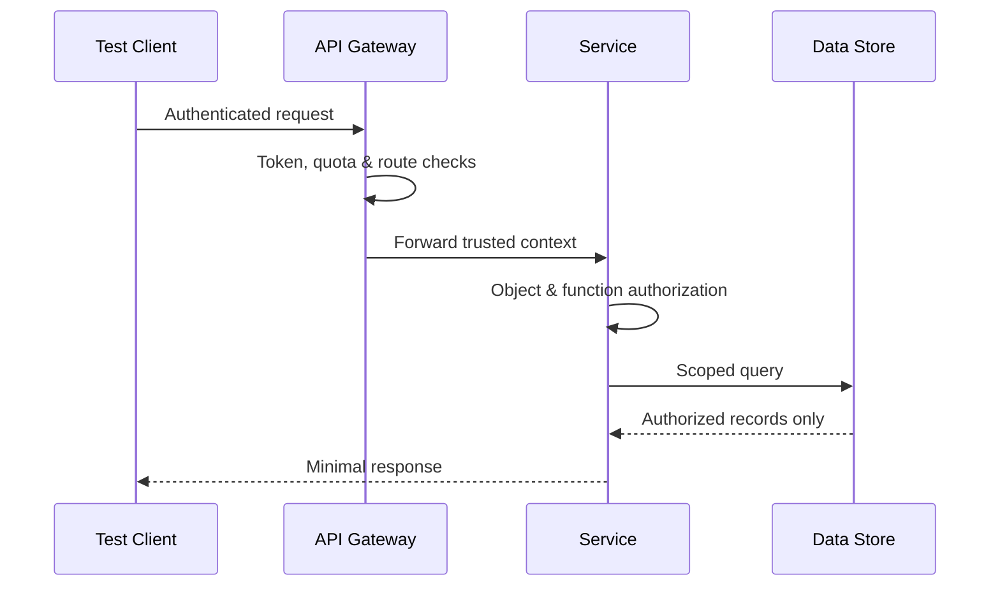
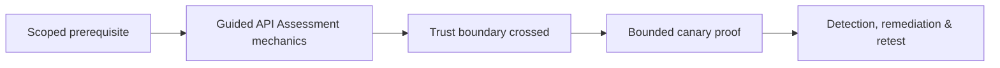

# Guided API Assessment

> [!warning] Authorized assessment
> Use synthetic tenants and records wherever possible. Rate-limit automation and coordinate tests that could trigger queues, notifications, billing, or irreversible workflows.

## Objective

An API assessment examines object-level authorization, function-level authorization, identity, data exposure, resource consumption, schema assumptions, workflow integrity, and downstream trust. It must cover more than endpoint fuzzing: the core question is whether the server consistently enforces the business model.



## 1. Build the API inventory

Collect approved specifications, gateway routes, application traffic, mobile-client behavior, version histories, event schemas, webhook contracts, and ownership data. Identify REST, GraphQL, SOAP, gRPC, WebSocket, asynchronous, partner, and internal interfaces. Compare documented routes with observed routes.

```text
surface,version,authn,tenant_context,data_class,owner
/v2/accounts/{id},v2,OIDC,claim+path,confidential,Accounts
/graphql,current,OIDC,claim,restricted,Platform
InvoiceCreated,v1,mTLS,topic+payload,financial,Billing
```

## 2. Create an identity matrix

Use at least two ordinary users in separate tenants, one privileged test role, and an unauthenticated state. Record subject IDs, tenant IDs, scopes, roles, token audience, and expected object ownership. This makes horizontal and vertical authorization tests deterministic.

## 3. Capture baseline requests

For every operation, save a legitimate request and response before mutating identifiers, methods, content types, nested fields, pagination, batch inputs, or workflow order. Mask secrets in evidence while retaining enough metadata to reproduce the result.

```http
GET /v2/accounts/acct-A-104 HTTP/1.1
Host: api.example.test
Authorization: Bearer <USER_A_TOKEN>
Accept: application/json

HTTP/1.1 200 OK
Content-Type: application/json
{"id":"acct-A-104","tenant":"tenant-A","status":"active"}
```

## 4. Test authorization invariants

Replace the object with an approved synthetic object belonging to User B; repeat through alternate verbs, nested resources, batch endpoints, exports, and indirect references. Test administrative functions with a lower role. The secure result is a consistent denial without metadata leakage.

## 5. Test data and parser boundaries

Probe omitted fields, explicit nulls, unknown properties, duplicate parameters, numeric boundaries, Unicode normalization, deeply nested objects, oversized collections, alternate encodings, and content-type mismatches. Verify mass-assignment defenses by adding server-controlled fields to a synthetic update.

```text
Expected invariant: client cannot set account.role
Request variant: {"displayName":"Test","role":"administrator"}
Secure outcome: role ignored or request rejected; audit event emitted
```

## 6. Test workflow and resource controls

Model state transitions such as quote → approve → pay → refund. Try skipped stages, repeated calls, reordered events, stale tokens, and concurrent requests against test records. Validate quotas by negotiation with the operations team; never discover production limits through uncontrolled exhaustion.

## 7. Evaluate observability

Confirm that request IDs survive gateway and service boundaries, authorization denials are measurable, sensitive values are redacted, and alerts distinguish ordinary validation errors from attack patterns. Correlate a small set of controlled failures with centralized telemetry.

## 8. Report and retest

Describe the violated business invariant, identities used, exact object relationship, minimal request delta, response, impact ceiling, and expected server-side control. Retest across equivalent endpoints and old API versions so the remediation is systemic.

---
> 🔼 Up: [[Guided Assessments]]

## Core Concept

**Guided API Assessment** is the atomic learning objective of this note. Identify its trust boundary, prerequisites, attacker-controlled input or state, vulnerable transformation, violated security invariant, minimum evidence, business consequence, and safe stopping point. The mechanism must remain explainable without depending on a specific product.

## Visual Attack Flow



## Practical Payloads & Execution

```text
engagement_action=Guided API Assessment
asset=C2R-CANARY
identity=authorized-test-principal
impact_ceiling=single synthetic proof
```

### Expected output

```text
expected_output=C2R_CANARY_PROOF
cleanup=verified
retest_condition=recorded
```

Treat the output as proof of only the stated condition. Repeat with a negative control, preserve timestamps and the affected build, and never expand impact merely because another path appears reachable.

## Real-World Scenario

A regulated enterprise assessment applies **Guided API Assessment** to a canary asset. Scope, evidence provenance, decision points, control outcomes, cleanup, ownership, and retest criteria are recorded so another qualified operator can reproduce the conclusion.

The durable remediation belongs at the authoritative enforcement layer. Retest the original condition and meaningful variants while verifying legitimate workflows still function.
