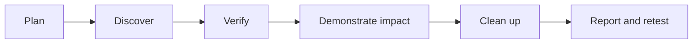

# Guided Assessments

> [!abstract] Lifecycle branch
> End-to-end enterprise walkthroughs that turn the methodology into reproducible engagement execution, evidence, findings, cleanup, and retesting.



## Master walkthroughs

- [[Guided Internal Pentest Walkthrough]]
- [[Guided Web App Walkthrough]]

## Engagement directory example

```text
engagement/
├── 00-scope-and-roe/
├── 01-raw-evidence/
├── 02-normalized-data/
├── 03-findings/
├── 04-cleanup/
└── 05-retest/
```

---
> 🔼 Up: [[Penetration Testing]]
