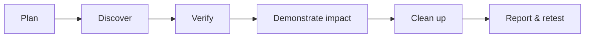

# Guided Assessments

> [!abstract] Lifecycle branch
> End-to-end enterprise walkthroughs that turn the methodology into reproducible engagement execution, evidence, findings, cleanup, and retesting.



## 🗺️ Zero-to-Mastery Learning Path

1. [[Guided External Pentest Walkthrough]]
2. [[Guided Internal Pentest Walkthrough]]
3. [[Guided Active Directory Assessment]]
4. [[Guided Web App Walkthrough]]
5. [[Guided API Assessment]]
6. [[Guided Wireless Assessment]]
7. [[Guided Social Engineering Exercise]]
8. [[Guided Cloud Security Assessment]]
9. [[Guided Red Team Operation]]
10. [[Guided Purple Team Validation]]
11. [[Guided Retest & Closure]]

## Engagement directory example

```text
engagement/
├── 00-scope-and-roe/
├── 01-raw-evidence/
├── 02-normalized-data/
├── 03-findings/
├── 04-cleanup/
└── 05-retest/
```

---
> 🔼 Up: [[Penetration Testing]]
