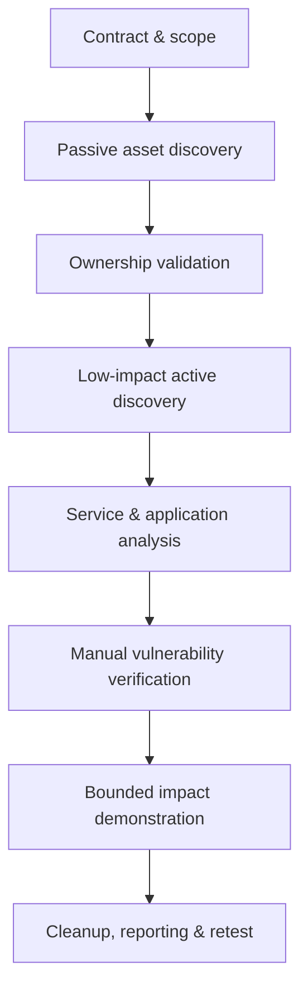
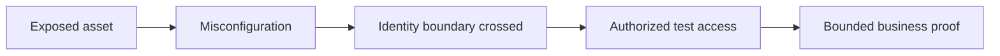
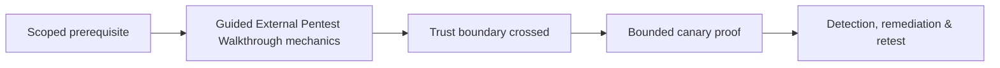

# Guided External Pentest Walkthrough

> [!warning] Authorized simulation
> Use this workflow only against the internet-facing assets explicitly listed in the signed scope. A discovered asset is not automatically an authorized asset.

## Outcome

An external penetration test answers whether an unauthenticated actor on the internet can identify the organization, cross its perimeter, obtain a foothold, or expose regulated information. The deliverable is not a scanner export; it is an evidence-backed account of reachable attack paths, their business consequences, and the controls that interrupted them.



## 1. Engagement preparation

Record legal entity names, CIDR blocks, domains, cloud tenants, test windows, source addresses, prohibited techniques, data-handling rules, emergency contacts, and the stop-work process. Resolve contradictions before traffic is sent. Define evidence timestamps in UTC and synchronize the assessment host.

```text
Scope ID: EXT-2026-014
Authorized: 198.51.100.0/28, portal.example.test
Excluded: status.example.test, third-party CDN, production DoS
Window: 22:00-04:00 UTC
Stop contact: SOC duty manager
Proof limit: one synthetic record; no bulk extraction
```

## 2. Build the candidate asset inventory

Begin with public records, certificate history, DNS metadata, autonomous-system ownership, archived application paths, recruitment technology clues, and exposed code metadata. Keep each candidate in a provenance ledger. Validate ownership before promoting it into the active-test queue.

| Candidate | Evidence | Ownership confidence | Active testing |
|---|---|---:|---|
| `vpn.example.test` | Current certificate + scoped domain | High | Allowed |
| `legacy.example-cdn.test` | Historical DNS only | Low | Hold |
| `198.51.100.6` | Scoped CIDR + current PTR | High | Allowed |

## 3. Discover the live perimeter safely

Use staged discovery: reachability checks, conservative TCP discovery, selective UDP validation, then protocol-aware enumeration. Distinguish a closed port from a silently dropped probe and repeat ambiguous observations from an approved secondary vantage point. Rate-limit tests around fragile appliances.

```text
22:18:03Z host=198.51.100.6 tcp/443 state=open confidence=high
22:18:04Z host=198.51.100.6 tcp/22 state=filtered confidence=medium
22:19:41Z host=198.51.100.7 udp/500 response=ike confidence=high
```

## 4. Form hypotheses before testing

Prioritize externally exploitable identity systems, remote administration, forgotten development endpoints, exposed management planes, weak trust boundaries, and vulnerable edge software. For each hypothesis, state expected evidence and a safe falsification method.

```text
Hypothesis: The staging hostname resolves to a production ingress with weaker authentication.
Confirm: Compare TLS identity, response headers, authentication flow, and tenant identifiers.
Impact limit: No credential guessing; use an approved test identity.
Disconfirm: Distinct tenant and no shared authorization context.
```

## 5. Verify findings manually

Reproduce each candidate with the smallest deterministic request. Capture request, response, server time, source address, affected asset, precondition, expected secure behavior, observed behavior, and cleanup state. Never use destructive proof when a reversible marker demonstrates the same control failure.

## 6. Demonstrate an attack path

Connect only independently verified facts. A meaningful path might join an abandoned hostname, leaked deployment metadata, weak identity recovery, and access to a non-production tenant. Rate the path by achieved privilege and business reach rather than by the loudness of individual vulnerabilities.



## 7. Close cleanly

Remove test accounts, uploaded markers, temporary DNS records, callback infrastructure, and collected secrets according to the evidence policy. Recheck every touched asset. Report confirmed findings separately from observations and unverified exposure. During retest, validate both the original request and likely variants so closure means the control is repaired, not merely that one string was blocked.

---
> 🔼 Up: [[Guided Assessments]]

## Core Concept

**Guided External Pentest Walkthrough** is the atomic learning objective of this note. Identify its trust boundary, prerequisites, attacker-controlled input or state, vulnerable transformation, violated security invariant, minimum evidence, business consequence, and safe stopping point. The mechanism must remain explainable without depending on a specific product.

## Visual Attack Flow



## Practical Payloads & Execution

```text
engagement_action=Guided External Pentest Walkthrough
asset=C2R-CANARY
identity=authorized-test-principal
impact_ceiling=single synthetic proof
```

### Expected output

```text
expected_output=C2R_CANARY_PROOF
cleanup=verified
retest_condition=recorded
```

Treat the output as proof of only the stated condition. Repeat with a negative control, preserve timestamps and the affected build, and never expand impact merely because another path appears reachable.

## Real-World Scenario

A regulated enterprise assessment applies **Guided External Pentest Walkthrough** to a canary asset. Scope, evidence provenance, decision points, control outcomes, cleanup, ownership, and retest criteria are recorded so another qualified operator can reproduce the conclusion.

The durable remediation belongs at the authoritative enforcement layer. Retest the original condition and meaningful variants while verifying legitimate workflows still function.
