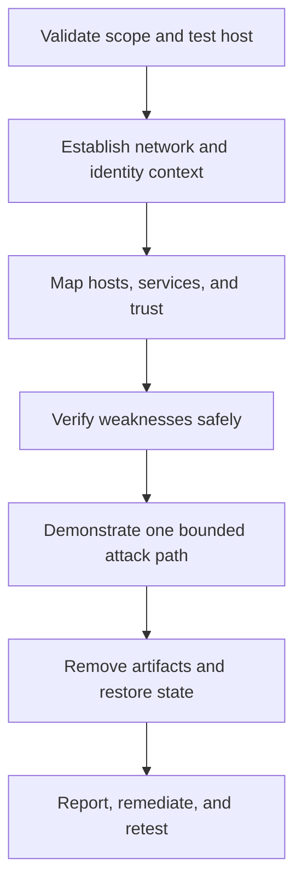
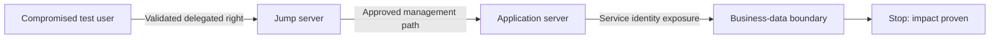

# Guided Internal Pentest Walkthrough

> [!warning] Authorized enterprise assessment
> Execute only within a signed Rules of Engagement document. Use test accounts where possible, stop at the agreed impact boundary, and preserve every command, timestamp, and cleanup action.

## Outcome

This walkthrough takes an internal assessment from a newly connected test workstation to an evidence-backed report. The goal is not “domain admin at any cost”; it is to prove which trust failures permit material business impact while minimizing operational risk.



## 1. Prepare the engagement

Record source addresses, approved subnets, excluded systems, test windows, emergency contacts, credential rules, denial-of-service prohibitions, and whether password spraying or relay testing is allowed. Synchronize time so terminal records correlate with server logs.

```shell-session
operator@assessment:~$ date -u
2026-07-30 08:15:22 UTC
operator@assessment:~$ ip -brief address show
lo               UNKNOWN        127.0.0.1/8
eth0             UP             10.40.18.77/24
operator@assessment:~$ mkdir -p engagement/{raw,normalized,findings,cleanup}
```

Create an evidence ledger with the command, operator, source, target, UTC time, result path, and a cryptographic digest. Sensitive output must be encrypted at rest and access-controlled.

## 2. Establish local context

Begin with low-impact observations: DHCP options, DNS suffixes, routes, default gateway, local ARP/neighbor cache, and the identity privileges supplied by the client. These reveal segmentation and naming conventions without broad traffic.

```powershell
PS C:\> Get-NetIPConfiguration | Format-List InterfaceAlias,IPv4Address,IPv4DefaultGateway,DNSServer
InterfaceAlias     : Ethernet
IPv4Address        : {10.40.18.77}
IPv4DefaultGateway : {MSFT_NetRoute (InstanceID = "...")}
DNSServer          : {10.40.10.10, 10.40.10.11}

PS C:\> whoami /all
USER INFORMATION
----------------
User Name             SID
corp\assessment.user  S-1-5-21-...-1138
```

## 3. Build the attack-surface model

Discover only approved ranges and pace probes to the environment. Group findings by function rather than merely listing open ports: identity infrastructure, management planes, file services, applications, databases, user endpoints, and security controls. Verify whether a “live” result is a real host, a load balancer, or deception system.

```text
Observation: 10.40.10.10 answers DNS, Kerberos, LDAP, SMB
Inference: likely domain controller; high-value and high-risk test target
Decision: enumerate directory metadata with provided account; do not exploit availability flaws
Evidence: raw/dc01-service-observation.txt
```

## 4. Enumerate identity and trust

Use least-privileged credentials to inspect domain naming, password and lockout policy, group membership, service accounts, delegation, shares, certificate services, and trust relationships. Treat directory data as a graph of principals, resources, and permissions. A path is actionable only after every edge is manually validated.

```powershell
PS C:\> Get-ADDomain | Select-Object DNSRoot,DomainMode
DNSRoot       DomainMode
-------       ----------
corp.example  Windows2016Domain

PS C:\> Get-ADDefaultDomainPasswordPolicy | Select LockoutThreshold,MinPasswordLength
LockoutThreshold MinPasswordLength
---------------- -----------------
               5                14
```

## 5. Validate weaknesses with bounded proofs

Prioritize paths with a plausible business consequence: excessive share access, local administrator reuse, weak service identities, delegated group-management rights, unsafe certificate templates, or management services reachable across trust boundaries. Use the smallest proof that establishes impact. Reading a client-provided canary file is safer than copying production data; creating and deleting a benign scheduled task is safer than deploying persistence.

```text
Finding hypothesis: Helpdesk group can modify membership of Server Operators.
Safe proof: Add the authorized canary account, query effective membership, then remove it.
Impact statement: A compromised helpdesk identity can obtain administrative control of tier-1 servers.
Cleanup evidence: Membership before/after and directory replication confirmation.
```

## 6. Demonstrate lateral movement and pivoting safely

Lateral movement is an impact demonstration, not a collection race. Select one approved route, prefer native authenticated administration, and avoid modifying endpoint security. For a segmented network, establish only a documented temporary route from the assessment host; record the listening interface, permitted destinations, owner, and teardown command.



## 7. Cleanup and verification

Track every account, token, file, process, service, tunnel, firewall exception, and configuration change. Remove them in reverse order, then ask system owners to verify from their telemetry. Never claim cleanup merely because a command returned success.

```shell-session
operator@assessment:~$ sha256sum cleanup/artifact-ledger.csv
4ad1d5f5d8d2...  cleanup/artifact-ledger.csv
operator@assessment:~$ tail -n 3 cleanup/artifact-ledger.csv
2026-07-30T11:42:10Z,test-task-01,removed,verified-by-host-owner
2026-07-30T11:45:03Z,temp-route-01,removed,no-listener-confirmed
2026-07-30T11:51:28Z,canary-account-membership,reverted,replication-confirmed
```

## 8. Report and retest

For each finding, include the violated trust assumption, prerequisites, reproducible evidence, affected assets, realistic impact, detection opportunities, root-cause remediation, and a safe retest procedure. Separate observed facts from inference. The executive narrative should explain the attack path; the technical appendix should make every claim independently reproducible.

---
> 🔼 Up: [[Guided Assessments]]
