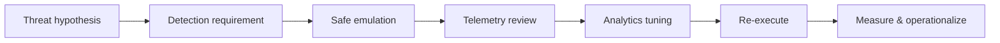
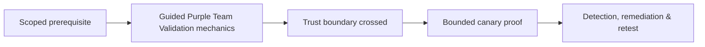

# Guided Purple Team Validation

> [!info] Collaborative validation
> Purple teaming is a controlled engineering loop in which attack behavior and defensive telemetry are examined together. Its purpose is measurable control improvement, not competition between teams.

## Objective

Validate whether a defined adversary behavior is prevented, observed, enriched, alerted, investigated, contained, and documented. Every test maps to a threat hypothesis and expected data source.



## 1. Select behavior, not a tool

Define the behavior in platform-neutral language. Example: a process reads a synthetic credential file and initiates an outbound connection to an approved sink. Identify prerequisites, benign analogues, expected endpoint and network telemetry, and maximum impact.

```text
Behavior ID: PT-VAL-014
Hypothesis: monitored workstation detects unusual access to canary credential material
Expected sources: process telemetry, file audit, DNS, proxy, identity audit
Success: alert enriched with host, user, process lineage, file, destination
```

## 2. Create a telemetry contract

Before execution, defenders state which events should exist, required fields, expected latency, retention, normalization, and ownership. This prevents an alert-only view that ignores missing raw data.

| Stage | Evidence | Pass condition |
|---|---|---|
| Collection | Raw endpoint event | Required fields present |
| Transport | Central arrival timestamp | Within latency objective |
| Detection | Analytic match | Expected severity and entity |
| Triage | Case enrichment | Host, identity, lineage, context |
| Response | Approved action | Safe containment path available |

## 3. Execute a minimum viable emulation

Use a dedicated test endpoint, synthetic account, inert artifact, controlled destination, and synchronized timestamps. Run one behavior at a time. The operator records exact start and stop times while the defender independently captures observed data.

```text
Operator: 13:00:05Z synthetic file read
Collector: 13:00:07Z endpoint event accepted
SIEM:      13:00:19Z normalized event searchable
Alert:     13:00:42Z analytic fired
Case:      13:01:10Z analyst acknowledged
```

## 4. Diagnose gaps by layer

Classify failure as generation, collection, transport, parsing, enrichment, analytic logic, suppression, routing, triage, or response. Avoid tuning a rule when the underlying event is absent or malformed.

## 5. Tune with negative controls

Collect representative benign activity and define exclusions around stable semantics—not filenames or easily changed strings. Re-run both malicious simulation and benign controls. Measure false-positive volume, duplicate alerts, and analyst workload.

## 6. Operationalize

Version the analytic, document data dependencies, assign ownership, establish health monitoring, add investigation guidance, and schedule recurring validation. A detection that worked once in a lab is not yet an operational control.

## 7. Score the outcome

Track prevention rate, telemetry completeness, alert precision, time to detect, time to triage, time to contain, analyst confidence, and retest status. Close only after repeated execution produces stable results.

---
> 🔼 Up: [[Guided Assessments]]

## Core Concept

**Guided Purple Team Validation** is the atomic learning objective of this note. Identify its trust boundary, prerequisites, attacker-controlled input or state, vulnerable transformation, violated security invariant, minimum evidence, business consequence, and safe stopping point. The mechanism must remain explainable without depending on a specific product.

## Visual Attack Flow



## Practical Payloads & Execution

```text
engagement_action=Guided Purple Team Validation
asset=C2R-CANARY
identity=authorized-test-principal
impact_ceiling=single synthetic proof
```

### Expected output

```text
expected_output=C2R_CANARY_PROOF
cleanup=verified
retest_condition=recorded
```

Treat the output as proof of only the stated condition. Repeat with a negative control, preserve timestamps and the affected build, and never expand impact merely because another path appears reachable.

## Real-World Scenario

A regulated enterprise assessment applies **Guided Purple Team Validation** to a canary asset. Scope, evidence provenance, decision points, control outcomes, cleanup, ownership, and retest criteria are recorded so another qualified operator can reproduce the conclusion.

The durable remediation belongs at the authoritative enforcement layer. Retest the original condition and meaningful variants while verifying legitimate workflows still function.
