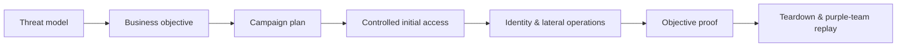
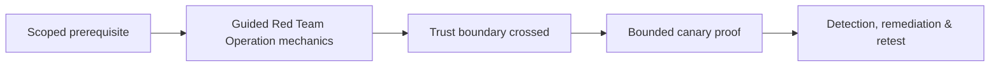

# Guided Red Team Operation

> [!warning] Controlled adversary emulation
> A red team operation is objective-driven and threat-informed. It does not grant unlimited freedom: every action remains bounded by the Rules of Engagement, safety plan, deconfliction process, and data-handling agreement.

## Objective-led planning

Translate an executive concern into measurable objectives. Example: determine whether a threat actor with contractor credentials can reach a synthetic engineering repository and whether the defensive team detects the path before the proof is accessed.



## 1. Build the operation cell

Assign operation lead, operators, infrastructure owner, safety officer, white-cell controller, legal contact, and executive sponsor. Establish authenticated deconfliction, medical and operational stop conditions, incident crossover rules, evidence encryption, daily check-ins, and infrastructure takedown authority.

```text
Objective: access synthetic design record ENG-CANARY-07
Initial condition: approved contractor identity
Impact ceiling: metadata proof only; no source-code download
No-go: persistence on domain controllers, production service interruption
Deconfliction phrase: challenge/response held by white cell
```

## 2. Convert intelligence into hypotheses

Select threat behaviors relevant to the organization’s sector, architecture, and controls. Create candidate paths but do not script the outcome. Each operation hypothesis needs prerequisites, safety constraints, observable telemetry, fallback options, and abort criteria.

## 3. Prepare controlled infrastructure

Use registered test domains, isolated redirectors, unique certificates, dedicated identities, allowlisted callback ranges where agreed, and complete ownership records. Pre-stage sinkholes and kill switches. Verify that no infrastructure can accidentally serve uncontrolled payloads or collect unrelated internet traffic.

## 4. Execute in decision cycles

Operate as observe → orient → decide → act. Record decisions, not only commands. Use minimum necessary access, validate a path incrementally, and stop when the objective is proven. If production instability, unexpected sensitive data, or third-party infrastructure appears, pause and contact the white cell.

```text
14:02 OBSERVE contractor token accepted by collaboration portal
14:07 ORIENT repository link exposed, authorization not yet tested
14:09 DECIDE request synthetic canary metadata only
14:10 ACT canary title returned; objective condition met
14:11 STOP no content downloaded; evidence sealed
```

## 5. Measure defense effectiveness

Track prevention, first telemetry, first triage, escalation, containment, and recovery for each tested behavior. Differentiate control failure from detection-process failure. Preserve the blue team’s independent timeline before revealing operator activity.

## 6. Teardown

Revoke test identities and tokens, remove controlled artifacts, dismantle infrastructure, expire certificates, validate DNS removal, close cloud resources, and inventory retained evidence. Obtain system-owner confirmation for every reversible change.

## 7. Replay and improve

Conduct a purple-team replay of important behaviors with defenders. The final report should include objective attainment, attack narrative, decision points, prevented alternatives, telemetry gaps, safety events, and prioritized systemic fixes.

---
> 🔼 Up: [[Guided Assessments]]

## Core Concept

**Guided Red Team Operation** is the atomic learning objective of this note. Identify its trust boundary, prerequisites, attacker-controlled input or state, vulnerable transformation, violated security invariant, minimum evidence, business consequence, and safe stopping point. The mechanism must remain explainable without depending on a specific product.

## Visual Attack Flow



## Practical Payloads & Execution

```text
engagement_action=Guided Red Team Operation
asset=C2R-CANARY
identity=authorized-test-principal
impact_ceiling=single synthetic proof
```

### Expected output

```text
expected_output=C2R_CANARY_PROOF
cleanup=verified
retest_condition=recorded
```

Treat the output as proof of only the stated condition. Repeat with a negative control, preserve timestamps and the affected build, and never expand impact merely because another path appears reachable.

## Real-World Scenario

A regulated enterprise assessment applies **Guided Red Team Operation** to a canary asset. Scope, evidence provenance, decision points, control outcomes, cleanup, ownership, and retest criteria are recorded so another qualified operator can reproduce the conclusion.

The durable remediation belongs at the authoritative enforcement layer. Retest the original condition and meaningful variants while verifying legitimate workflows still function.
