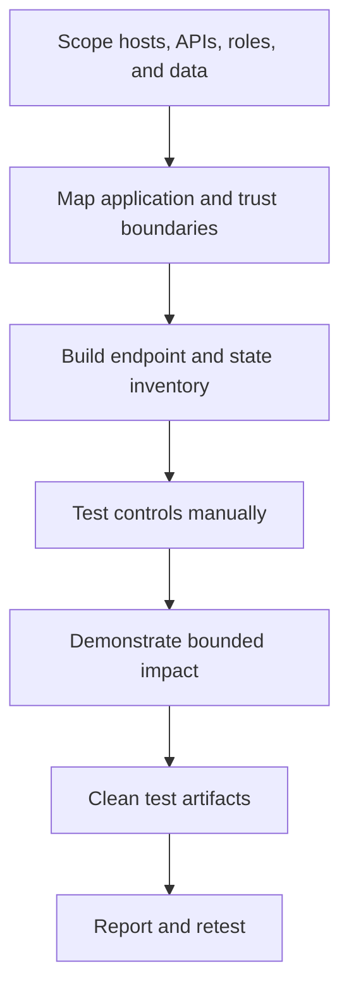
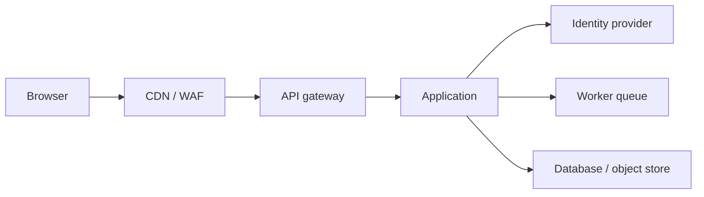
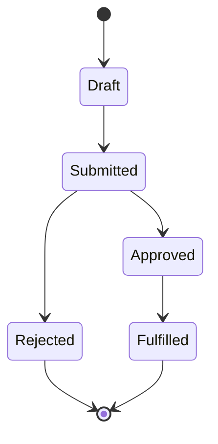

# Guided Web App Walkthrough

> [!warning] Authorized enterprise assessment
> Use a staging environment or explicitly approved production scope. Never send destructive payloads, retrieve real customer records, or bypass availability controls unless the Rules of Engagement explicitly authorize the exact action.

## Outcome

This walkthrough converts a URL and test identities into a defensible assessment of architecture, authorization, session handling, input boundaries, and business workflows.



## 1. Freeze scope and identities

Record hostnames, mobile/API endpoints, third-party integrations, approved callback domains, prohibited records, rate limits, and the supplied roles. Ask for at least two ordinary users in different tenants plus one privileged test identity; authorization failures are difficult to assess with a single account.

```text
Tenant A user: alice.test / role=user
Tenant B user: bob.test / role=user
Tenant A admin: admin.test / role=administrator
Forbidden actions: payment capture, email delivery, bulk export, load testing
Test marker: C2R-20260730
```

## 2. Map the application

Browse every role and capture methods, paths, parameters, content types, redirects, cookies, anti-CSRF values, object identifiers, and state transitions. Include JavaScript-discovered endpoints, API specifications, WebSocket channels, file-processing paths, and asynchronous jobs.

```http
GET /api/v1/invoices/7412 HTTP/1.1
Host: portal.example.test
Cookie: session=REDACTED
Accept: application/json

HTTP/1.1 200 OK
Content-Type: application/json
X-Request-ID: e9131d0f
```

Create a role-action matrix before testing:

| Capability | Anonymous | Tenant user | Tenant admin |
|---|---:|---:|---:|
| View own invoice | No | Yes | Yes |
| View another tenant | No | No | No |
| Invite user | No | No | Yes |
| Export all records | No | No | Approved admin only |

## 3. Model trust boundaries

Identify where the browser, edge/CDN, gateway, application, identity provider, queues, object storage, and internal services make security decisions. Client-side validation is not a trust boundary. A signed token proves whatever the verifier actually checks—not every claim the developer intended to constrain.



## 4. Test authentication and sessions

Review registration, recovery, MFA enrollment and reset, federation callbacks, session rotation, logout, remembered devices, and concurrent sessions. Change one variable at a time. Confirm whether server-side state—not UI visibility—enforces each control.

```http
POST /api/v1/password-reset/confirm HTTP/1.1
Content-Type: application/json

{"token":"test-token","newPassword":"Approved-Test-Only-42!"}

HTTP/1.1 400 Bad Request
{"error":"token expired"}
```

Record the expected secure result alongside the observation. Avoid automated credential attacks unless rate-testing is explicitly authorized.

## 5. Test authorization and tenant isolation

Replay known-valid requests while substituting object IDs, parent IDs, tenant headers, HTTP methods, content types, and roles. Test list, read, update, delete, export, and indirect actions separately. A 403 on `GET` does not prove `PUT` is protected.

```text
Control request: Tenant A reads invoice A-7412 -> 200
Variant: Tenant B reads invoice A-7412 -> expected 403/404
Observed: 200 with test invoice metadata
Bounded proof: stop after test record; do not enumerate adjacent identifiers
```

## 6. Test input and parser boundaries

Trace input from source to sink: database query, shell, template, file path, XML parser, deserializer, URL fetcher, or log formatter. Start with harmless syntax probes and differential responses. Escalate only enough to distinguish validation, parsing, and execution behavior.

```text
Baseline response: 200, 842 bytes, 118 ms
Quoted-input response: 500, 119 bytes, 121 ms
Time-control response: 200, 842 bytes, 116 ms
Interpretation: parser error likely; no evidence of time-based execution
```

## 7. Test business workflows

Diagram states and invariants for purchases, approvals, invitations, refunds, entitlements, and quotas. Test skipping steps, replaying transitions, using stale objects, concurrent submissions, negative values, and cross-role actions. Business impact—not payload novelty—determines severity.



If the server accepts `Draft → Fulfilled`, capture one canary transaction and stop.

## 8. Validate edge behavior

Compare normalized requests across edge and origin layers: duplicated headers, conflicting lengths, path encoding, host routing, cache keys, CORS decisions, and WebSocket upgrades. Treat a WAF response as evidence of edge behavior, not proof that the origin is safe.

## 9. Evidence, cleanup, and retest

Save raw requests and responses with secrets redacted, request IDs intact, and UTC timestamps. Delete test users, uploads, orders, invitations, and callbacks. A retest must reproduce the original request, demonstrate the corrected response, and check adjacent variants for partial fixes.

```shell-session
analyst@workstation:~$ sha256sum evidence/F-04-request.txt evidence/F-04-response.txt
87af...  evidence/F-04-request.txt
4c11...  evidence/F-04-response.txt
analyst@workstation:~$ printf '%s\n' 'C2R-20260730 artifacts removed; owner verification pending'
C2R-20260730 artifacts removed; owner verification pending
```

---
> 🔼 Up: [[Guided Assessments]]
