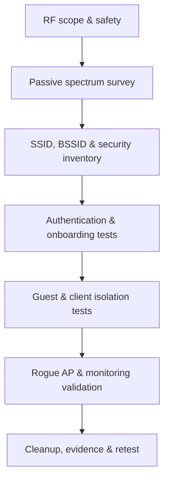
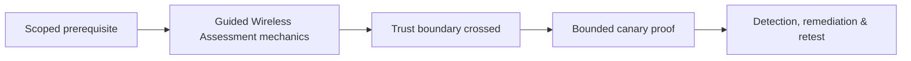

# Guided Wireless Assessment

> [!warning] Radio-frequency scope
> Wireless signals cross property boundaries. Specify authorized SSIDs, BSSIDs, physical zones, channels, test stations, deauthentication policy, rogue-access-point policy, and safety contacts before transmission.

## Objective

Evaluate whether wireless identity, encryption, segmentation, onboarding, roaming, management frames, and monitoring prevent unauthorized access and lateral movement. Include corporate, guest, IoT, warehouse, and building-control networks where explicitly authorized.



## Preparation

Map authorized spaces and record expected access points, channel plans, transmit power, security modes, RADIUS infrastructure, certificate authorities, mobile-device management, network access control, and wireless intrusion detection. Use a designated test client with a known MAC address and synthetic identity.

```text
Zone: Building A / floors 2-4
Authorized SSIDs: CORP-EAP, GUEST, IOT-TEST
Permitted: passive capture, test-client association, approved rogue-AP drill
Prohibited: broad deauthentication, neighboring networks, production credential capture
```

## Passive survey

Observe beacon and probe behavior without association. Inventory BSSID, SSID, band, channel width, security mode, protected management-frame status, vendor indicators, signal strength, and location. Look for legacy encryption, unexpected open networks, hidden-name leakage, inconsistent enterprise security, and unauthorized access points. A name match alone never proves ownership.

```text
time,bssid,ssid,band,channel,security,pmf,rssi
09:14:02,02:00:5e:10:00:01,CORP-EAP,5GHz,44,WPA3-Enterprise,required,-48
09:15:31,02:00:5e:10:00:09,CORP-EAP,2.4GHz,6,WPA2-PSK,optional,-61
```

## Authentication and onboarding

Validate certificate checking, server-name constraints, EAP method selection, machine/user authentication, device compliance, certificate renewal, employee offboarding, guest expiration, pre-shared-key rotation, and IoT enrollment. Determine whether a test client accepts an untrusted authentication server; do not collect real user credentials.

## Segmentation and isolation

After authorized association, test expected reachability from each role. Guest clients should not reach corporate address space or each other unless intentionally allowed. IoT networks should expose only required controllers and egress. Validate IPv4, IPv6, local discovery, DNS, and management interfaces because policy often differs by protocol.

| Source role | Expected destinations | Denied destinations |
|---|---|---|
| Guest | Internet, captive portal | Corporate, peer guests, management |
| IoT test | Controller, DNS, time | User VLANs, hypervisors, admin planes |
| Corporate test | Role-authorized services | Infrastructure management by default |

## Rogue AP and detection drill

With written approval, operate a low-power controlled access point using a clearly documented test identifier. Measure whether wireless monitoring, NAC, physical security, and SOC workflows identify the event. Stop if unintended clients attempt association; never solicit production credentials.

## Closure

Power down test radios, remove profiles and certificates, revoke temporary identities, restore access-point settings, and verify no rogue configuration remains. Report coverage gaps, weak identity validation, segmentation failures, and monitoring outcomes with RF location and timestamp evidence.

---
> 🔼 Up: [[Guided Assessments]]

## Core Concept

**Guided Wireless Assessment** is the atomic learning objective of this note. Identify its trust boundary, prerequisites, attacker-controlled input or state, vulnerable transformation, violated security invariant, minimum evidence, business consequence, and safe stopping point. The mechanism must remain explainable without depending on a specific product.

## Visual Attack Flow



## Practical Payloads & Execution

```text
engagement_action=Guided Wireless Assessment
asset=C2R-CANARY
identity=authorized-test-principal
impact_ceiling=single synthetic proof
```

### Expected output

```text
expected_output=C2R_CANARY_PROOF
cleanup=verified
retest_condition=recorded
```

Treat the output as proof of only the stated condition. Repeat with a negative control, preserve timestamps and the affected build, and never expand impact merely because another path appears reachable.

## Real-World Scenario

A regulated enterprise assessment applies **Guided Wireless Assessment** to a canary asset. Scope, evidence provenance, decision points, control outcomes, cleanup, ownership, and retest criteria are recorded so another qualified operator can reproduce the conclusion.

The durable remediation belongs at the authoritative enforcement layer. Retest the original condition and meaningful variants while verifying legitimate workflows still function.
