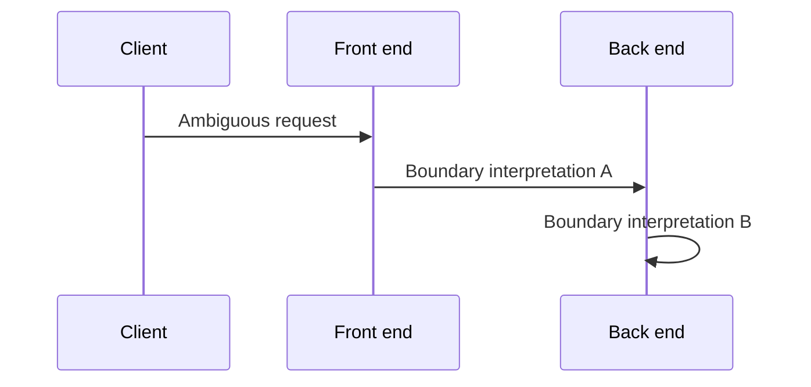
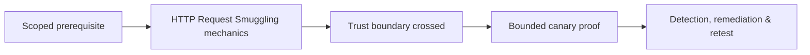

# HTTP Request Smuggling

Request smuggling occurs when front-end and back-end components disagree about message boundaries or normalization.



Study CL.TE, TE.CL, TE.TE normalization, duplicate/obfuscated headers, HTTP/2 downgrading, pause/desync behavior, connection reuse, and response queues. Testing can poison other users and therefore requires isolated backends or explicit production controls.

Use harmless canary paths and single-user connections; stop at parser differential. Remediate by rejecting ambiguous requests, normalizing once, maintaining consistent protocol stacks, disabling unsafe downgrade paths, and testing every proxy/gateway/origin combination.

Mastery lab: place two intentionally different parsers in a range, demonstrate desynchronization with canary responses, then configure consistent rejection.

---
> 🔼 Up: [[HTTP Architecture & Advanced Web Attacks]]

## Core Concept

**HTTP Request Smuggling** is the atomic learning objective of this note. Identify its trust boundary, prerequisites, attacker-controlled input or state, vulnerable transformation, violated security invariant, minimum evidence, business consequence, and safe stopping point. The mechanism must remain explainable without depending on a specific product.

## Visual Attack Flow



## Practical Payloads & Execution

```http
POST /c2r-lab/http-request-smuggling HTTP/1.1
Host: app.example.test
Authorization: Bearer <CANARY_IDENTITY>
Content-Type: application/json

{"object":"C2R-CANARY","test":true}
```

### Expected output

```text
HTTP/1.1 200 OK
X-C2R-Result: vulnerable-condition-observed
{"marker":"C2R-CANARY-PROOF"}
```

Treat the output as proof of only the stated condition. Repeat with a negative control, preserve timestamps and the affected build, and never expand impact merely because another path appears reachable.

## Real-World Scenario

A multi-tenant enterprise service exposes a scoped **HTTP Request Smuggling** condition to a synthetic customer account. The assessor proves one trust-boundary failure with a canary object, correlates application and identity telemetry, removes test state, and assigns the authoritative server-side control.

The durable remediation belongs at the authoritative enforcement layer. Retest the original condition and meaningful variants while verifying legitimate workflows still function.
