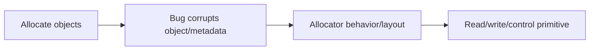
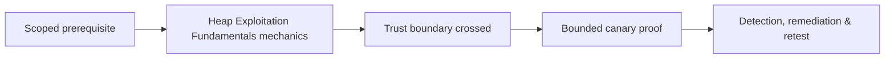

# Heap Exploitation Fundamentals

Heap bugs affect dynamically allocated objects and allocator metadata: overflows, underflows, double free, invalid free, use-after-free, and uninitialized memory.



Understand chunks, bins/caches, coalescing, metadata, size classes, fragmentation, grooming, and allocator hardening. glibc, Windows heaps, jemalloc, and language runtimes differ significantly.

Use toy allocators and disposable fixtures; do not transplant version-specific techniques blindly. Mastery lab: visualize allocations/frees, trigger a canary overflow and double free under sanitizers, and explain why modern allocator checks change exploitability.

## Allocator reasoning

Trace every allocation by address, requested size, usable size, lifetime, owner, and neighboring object. Then model the bug as a primitive: overwrite adjacent data, reuse a freed object, free the same chunk twice, or disclose uninitialized content. Exploitability depends on whether the allocator places a security-relevant target nearby and whether hardening detects metadata corruption first.

```text
event  pointer       size  state      owner
alloc  0x55556020    0x40  in-use     request
free   0x55556020    0x40  cache      request
use    0x55556020    ----  stale      callback dereference
```

Study safe-linking, per-thread caches, quarantine, guard pages, randomized layout, integrity checks, and memory tagging as constraints. Use AddressSanitizer and allocator diagnostics to establish root cause before attempting controlled layout manipulation. A high-quality report separates crashability, read/write primitive, reliability, and control-flow impact.

---
> 🔼 Up: [[Memory Corruption Exploitation]]

## Core Concept

**Heap Exploitation Fundamentals** is the atomic learning objective of this note. Identify its trust boundary, prerequisites, attacker-controlled input or state, vulnerable transformation, violated security invariant, minimum evidence, business consequence, and safe stopping point. The mechanism must remain explainable without depending on a specific product.

## Visual Attack Flow



## Practical Payloads & Execution

```text
fixture=Heap Exploitation Fundamentals
build=instrumented-debug
action=trigger minimized canary input
impact_ceiling=fixed marker or deterministic crash
```

### Expected output

```text
result=C2R_CANARY_PROOF
mitigation_state=recorded
production_boundary_crossed=false
```

Treat the output as proof of only the stated condition. Repeat with a negative control, preserve timestamps and the affected build, and never expand impact merely because another path appears reachable.

## Real-World Scenario

A vendor-owned instrumented build reproduces **Heap Exploitation Fundamentals**. The researcher demonstrates only a fixed marker or deterministic crash, records architecture and mitigation assumptions, patches the root defect, and retains the minimized input as a regression test.

The durable remediation belongs at the authoritative enforcement layer. Retest the original condition and meaningful variants while verifying legitimate workflows still function.
