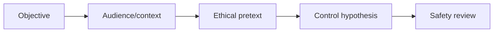

# Human Factors & Pretext Development

## 🗺️ Zero-to-Mastery Learning Path

1. [[Influence, Decision-Making & Human Risk]]
2. [[OSINT-Driven Pretext Development]]

---
> 🔼 Up: [[Social Engineering]]
