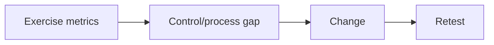
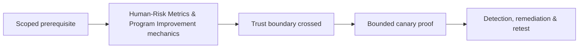

# Human-Risk Metrics & Program Improvement

Metrics should measure systems: delivery-control performance, report rate/time, verification-process use, SOC triage, containment, repeat themes, and remediation—not shame individuals.



Segment only where privacy and sample size allow. Click rate without delivery, difficulty, cohort, and reporting context is misleading. Mastery lab: build a dashboard that connects each metric to an owner, action, target, and retest date.

## A defensible measurement model

Separate the exercise funnel into attempted, delivered, blocked, opened, interacted, independently verified, reported, triaged, and contained. Denominators matter: interaction among delivered messages is different from interaction among all attempted messages. Report medians and distributions for time metrics; a single average hides delayed response.

| Metric | What it reveals | Misuse to avoid |
|---|---|---|
| Preventive-control rate | Mail, identity, or endpoint blocking | Treating non-delivery as user success |
| Median report time | Human sensing speed | Ignoring late but useful reports |
| Verification adherence | Process resilience | Ranking named individuals |
| Triage and containment time | Operational readiness | Excluding after-hours exercises |

Use minimum cohort sizes, role-based aggregation, fixed retention, and access controls. Track scenario difficulty, channel, exposure duration, and control changes so trends are comparable. Every metric must connect to an owner and intervention—technical control, process redesign, training, or playbook update. Retest the threat hypothesis rather than repeating an identical lure. Improvement means fewer unsafe process outcomes and faster collective response, not simply a lower click percentage.

---
> 🔼 Up: [[Social Engineering Exercise Governance & Metrics]]

## Core Concept

**Human-Risk Metrics & Program Improvement** is the atomic learning objective of this note. Identify its trust boundary, prerequisites, attacker-controlled input or state, vulnerable transformation, violated security invariant, minimum evidence, business consequence, and safe stopping point. The mechanism must remain explainable without depending on a specific product.

## Visual Attack Flow



## Practical Payloads & Execution

```text
exercise=Human-Risk Metrics & Program Improvement
cohort=privacy-approved canary group
maximum_action=harmless marker
real_credentials_collected=false
```

### Expected output

```text
prevented_or_reported=true
participant_harm=none
control_owner=identified
```

Treat the output as proof of only the stated condition. Repeat with a negative control, preserve timestamps and the affected build, and never expand impact merely because another path appears reachable.

## Real-World Scenario

A privacy-approved enterprise exercise applies **Human-Risk Metrics & Program Improvement** with synthetic identities and a harmless canary action. Legal, HR, privacy, and the white team define prohibited themes and stop conditions; results measure process and control performance rather than individuals.

The durable remediation belongs at the authoritative enforcement layer. Retest the original condition and meaningful variants while verifying legitimate workflows still function.
