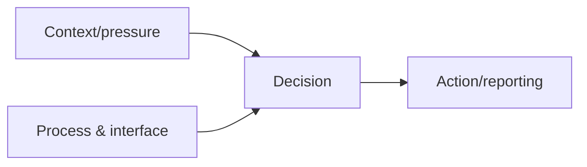
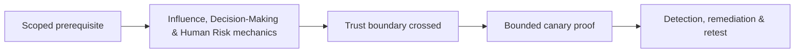

# Influence, Decision-Making & Human Risk

Social attacks exploit context, authority, urgency, reciprocity, familiarity, scarcity, fear, workload, and process ambiguity—not user stupidity.



Assess whether processes support verification, refusal, escalation, and reporting. Avoid shame and individual ranking. Mastery lab: redesign a high-pressure payment and password-reset process so secure behavior is the easiest behavior.

## From cognitive shortcut to enterprise risk

People make rapid decisions by using cues: the apparent authority of a sender, consistency with an existing conversation, urgency, social proof, and the cost of delaying work. These shortcuts are not defects; they are necessary under workload. Risk appears when a business process lets one plausible message authorize a high-impact action. A mature assessment therefore maps **decision → authority → verification → consequence**, rather than counting who clicked.

| Pressure cue | Unsafe process condition | Resilient control |
|---|---|---|
| Executive urgency | One-person payment release | Independent approval in the payment system |
| Familiar supplier | Bank changes accepted by email | Callback to a known number and change hold |
| Help-desk empathy | Identity established with public facts | Strong recovery factors and supervisor escalation |
| Notification fatigue | Repeated prompts without context | Number matching, device context, rate limits |

## Practical analysis

For an approved workflow, interview process owners, observe normal exceptions, and identify where staff must choose between delivery speed and verification. Build a harmless scenario around that tension. Record which technical and procedural layers intervene: sender authentication, warning banners, identity checks, approval separation, user reporting, analyst triage, and transaction reversal.

```text
Decision: approve supplier bank change
Authority claimed: finance director
Independent evidence available: vendor master record + known phone number
Irreversible point: payment batch release
Required control: two-person approval outside the message channel
```

Mastery means designing systems in which refusal is socially safe, verification is fast, and urgent exceptions leave a reviewable audit trail.

---
> 🔼 Up: [[Human Factors & Pretext Development]]

## Core Concept

**Influence, Decision-Making & Human Risk** is the atomic learning objective of this note. Identify its trust boundary, prerequisites, attacker-controlled input or state, vulnerable transformation, violated security invariant, minimum evidence, business consequence, and safe stopping point. The mechanism must remain explainable without depending on a specific product.

## Visual Attack Flow



## Practical Payloads & Execution

```text
exercise=Influence, Decision-Making & Human Risk
cohort=privacy-approved canary group
maximum_action=harmless marker
real_credentials_collected=false
```

### Expected output

```text
prevented_or_reported=true
participant_harm=none
control_owner=identified
```

Treat the output as proof of only the stated condition. Repeat with a negative control, preserve timestamps and the affected build, and never expand impact merely because another path appears reachable.

## Real-World Scenario

A privacy-approved enterprise exercise applies **Influence, Decision-Making & Human Risk** with synthetic identities and a harmless canary action. Legal, HR, privacy, and the white team define prohibited themes and stop conditions; results measure process and control performance rather than individuals.

The durable remediation belongs at the authoritative enforcement layer. Retest the original condition and meaningful variants while verifying legitimate workflows still function.
