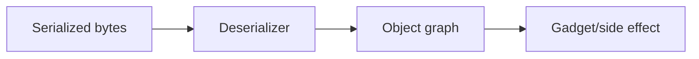
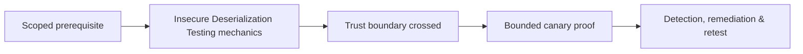

# Insecure Deserialization Testing

Unsafe native object deserialization can invoke constructors, callbacks, gadget chains, type binding, or state changes before validation.



Identify Java serialization, PHP `unserialize`, Python pickle, .NET legacy serializers, Ruby Marshal, YAML object tags, signed/encrypted blobs, and framework session formats. Do not run public gadget generators against production. Use harmless canary classes in isolated fixtures to establish object construction or callback behavior.

Integrity signatures do not make dangerous deserialization safe if keys leak or trusted data can be influenced. Remediate with simple typed formats, schema validation, explicit type allowlists, no native object graphs from untrusted sources, key rotation, and process sandboxing.

Mastery lab: compare JSON DTO binding with native deserialization and demonstrate a canary side effect, then remove the unsafe format.

---
> 🔼 Up: [[File, Parser & Serialization Security]]

## Core Concept

**Insecure Deserialization Testing** is the atomic learning objective of this note. Identify its trust boundary, prerequisites, attacker-controlled input or state, vulnerable transformation, violated security invariant, minimum evidence, business consequence, and safe stopping point. The mechanism must remain explainable without depending on a specific product.

## Visual Attack Flow



## Practical Payloads & Execution

```http
POST /c2r-lab/insecure-deserialization-testing HTTP/1.1
Host: app.example.test
Authorization: Bearer <CANARY_IDENTITY>
Content-Type: application/json

{"object":"C2R-CANARY","test":true}
```

### Expected output

```text
HTTP/1.1 200 OK
X-C2R-Result: vulnerable-condition-observed
{"marker":"C2R-CANARY-PROOF"}
```

Treat the output as proof of only the stated condition. Repeat with a negative control, preserve timestamps and the affected build, and never expand impact merely because another path appears reachable.

## Real-World Scenario

A multi-tenant enterprise service exposes a scoped **Insecure Deserialization Testing** condition to a synthetic customer account. The assessor proves one trust-boundary failure with a canary object, correlates application and identity telemetry, removes test state, and assigns the authoritative server-side control.

The durable remediation belongs at the authoritative enforcement layer. Retest the original condition and meaningful variants while verifying legitimate workflows still function.
