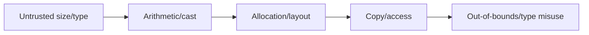
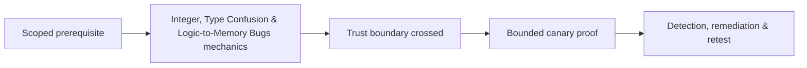

# Integer, Type Confusion & Logic-to-Memory Bugs

Integer overflow/underflow, truncation, signedness, allocation arithmetic, and type confusion can turn valid-looking logic into memory corruption.



Check addition/multiplication before allocation, narrowing conversions, negative-to-unsigned changes, alignment, array indexing, discriminated unions, deserialization tags, virtual dispatch, and JIT/object representations.

```c
if (count > SIZE_MAX / element_size) return ERROR;
size_t bytes = count * element_size;
```

Mastery lab: create overflow-to-small-allocation and unsafe-downcast fixtures, detect with UBSan, and implement checked arithmetic plus validated type tags.

## Audit method

Follow attacker-controlled values from parse type through every promotion, cast, arithmetic operation, allocation, bounds check, and access. Write the range expected at each boundary. Pay special attention to mixed signed/unsigned comparison, multiplication before allocation, units such as elements versus bytes, alignment rounding, and 32-to-64-bit transitions.

```text
input count = 0x40000001
element size = 4
32-bit product = 0x00000004
allocation = 4 bytes, copy expectation = 0x40000001 elements
```

Type confusion analysis maps the expected object layout against the actual runtime object and identifies which fields, lengths, or dispatch pointers become misinterpreted. Defenses include checked arithmetic, explicit bounds, tagged unions, safe downcasts, compiler sanitizers, fuzzing boundary values, and memory-safe abstractions. Severity depends on the resulting primitive, not merely the presence of an overflow.

---
> 🔼 Up: [[Memory Corruption Exploitation]]

## Core Concept

**Integer, Type Confusion & Logic-to-Memory Bugs** is the atomic learning objective of this note. Identify its trust boundary, prerequisites, attacker-controlled input or state, vulnerable transformation, violated security invariant, minimum evidence, business consequence, and safe stopping point. The mechanism must remain explainable without depending on a specific product.

## Visual Attack Flow



## Practical Payloads & Execution

```text
fixture=Integer, Type Confusion & Logic-to-Memory Bugs
build=instrumented-debug
action=trigger minimized canary input
impact_ceiling=fixed marker or deterministic crash
```

### Expected output

```text
result=C2R_CANARY_PROOF
mitigation_state=recorded
production_boundary_crossed=false
```

Treat the output as proof of only the stated condition. Repeat with a negative control, preserve timestamps and the affected build, and never expand impact merely because another path appears reachable.

## Real-World Scenario

A vendor-owned instrumented build reproduces **Integer, Type Confusion & Logic-to-Memory Bugs**. The researcher demonstrates only a fixed marker or deterministic crash, records architecture and mitigation assumptions, patches the root defect, and retains the minimized input as a regression test.

The durable remediation belongs at the authoritative enforcement layer. Retest the original condition and meaningful variants while verifying legitimate workflows still function.
