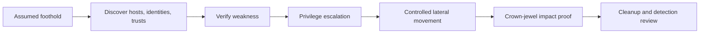
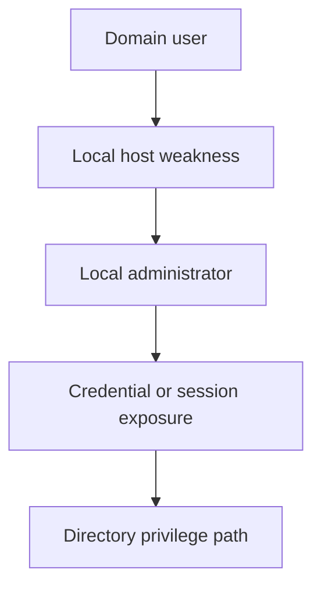
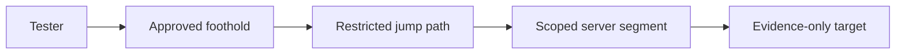

# Internal Network Pentesting

> [!abstract] Enterprise methodology
> Internal testing models a compromised workstation, malicious insider, or unauthorized device. It evaluates segmentation, identity, Active Directory, service trust, credential exposure, privilege boundaries, lateral movement, detection, and whether a limited foothold can reach crown-jewel systems.

> [!danger] Authorized simulation
> Domain attacks, relays, coercion, password material, lateral movement, and pivoting can affect production authentication. Use client-provided accounts, synthetic targets, approved source hosts, stop conditions, and live SOC de-confliction.

## Attack-path model



## Establish the assumed-breach starting point

Record the exact initial conditions:

```text
Host: WIN-USER-042
Identity: EXAMPLE\audit.user
Network: corporate-user VLAN
Privileges: standard user; no local admin
Security controls: EDR enabled; PowerShell logging enabled
Objective: determine whether user-tier compromise reaches finance administration
```

Changing the initial privilege changes the threat model and must be documented.

## Local and network situational awareness

Use native, low-impact observations first:

```powershell
PS> whoami /all
USER INFORMATION
User Name          SID
example\audit.user S-1-5-21-...-1142

PS> ipconfig /all
DNS Suffix Search List. . . . . . : example.internal
Default Gateway . . . . . . . . . : 10.20.40.1

PS> klist
Cached Tickets: (2)
#0> Client: audit.user @ EXAMPLE.INTERNAL
```

Observe domain membership, DNS suffixes, routes, proxy configuration, mapped shares, logged-on context, endpoint controls, and available management protocols. Do not disable controls to make testing easier.

## Active Directory attack-path analysis

Model AD as objects and permissions:

- Users, computers, groups, organizational units, and trusts.
- Service accounts and service principal names.
- Local-administrator relationships.
- Group Policy links and delegated management.
- Certificate templates and enrollment rights.
- Sessions and administrative tiers.
- ACL edges such as object control, ownership, group modification, and password-reset rights.

Representative low-impact directory output:

```powershell
PS> Get-ADDomain | Select-Object DNSRoot,DomainMode
DNSRoot          DomainMode
-------          ----------
example.internal Windows2016Domain

PS> Get-ADGroupMember 'Server Operators' | Select-Object Name,ObjectClass
Name          ObjectClass
----          -----------
svc-platform  user
```

An attack graph is a hypothesis generator. Every edge must be manually confirmed before use.

## Authentication and delegation testing

Evaluate:

- Kerberos preauthentication and service-ticket exposure.
- NTLM use, signing requirements, channel binding, and relay resistance.
- Constrained, unconstrained, and resource-based delegation.
- Service-account privilege, password management, and logon restrictions.
- Certificate enrollment templates and issuance policy.
- Cross-domain/forest trust direction, SID filtering, and administrative boundaries.

Use synthetic identities and approved targets for any coercion or relay scenario. Do not capture unrelated user credentials.

## Privilege escalation

Assess host and directory privilege separately:



Common conditions include weak service permissions, unsafe scheduled tasks, token privileges, writable privileged paths, local-admin reuse, excessive group membership, and delegated directory ACLs. Prove with a reversible canary action whenever possible.

## Lateral movement

Lateral movement is a controlled test of trust and management channels, not a race to touch every host. Validate:

- Which identities can authenticate remotely.
- Which protocols permit administration.
- Whether network segmentation matches role and tier.
- Whether privileged sessions appear on lower-trust hosts.
- Whether endpoint and identity controls detect the movement.

Example controlled access check:

```powershell
PS> Test-NetConnection server-02.example.internal -Port 5985
ComputerName     : server-02.example.internal
RemotePort       : 5985
TcpTestSucceeded : True
```

Reachability is not authorization. Use only the management method and account approved in the RoE.

## Pivoting and segmentation

A pivot provides a route from one authorized zone to another. Before establishing it, document source, destination, ports, duration, ownership, logging, and cleanup. Avoid turning a test host into an uncontrolled general-purpose proxy.



The proof should answer a segmentation question: *Can this compromised tier reach and authenticate to that protected tier?*

## Crown-jewel impact proof

Use client-defined objectives such as finance administration, identity control, backup management, source-code systems, or sensitive databases. Prefer synthetic records and canary operations:

```text
Objective: demonstrate unauthorized finance-report access
Proof: read client-created canary report using compromised test role
Not performed: bulk export, modification, persistence
Detection: SOC alert generated after 94 seconds
Cleanup: session/token invalidated; canary permissions restored
```

## Defensive validation and cleanup

Correlate endpoint, authentication, directory, network, and application telemetry. Record what was detected, what was missed, and whether analysts could reconstruct the path. Remove accounts, tickets, tunnels, files, scheduled tasks, services, and configuration changes created for testing; obtain owner confirmation.

---
> 🔼 Up: [[Network Penetration Testing]]
