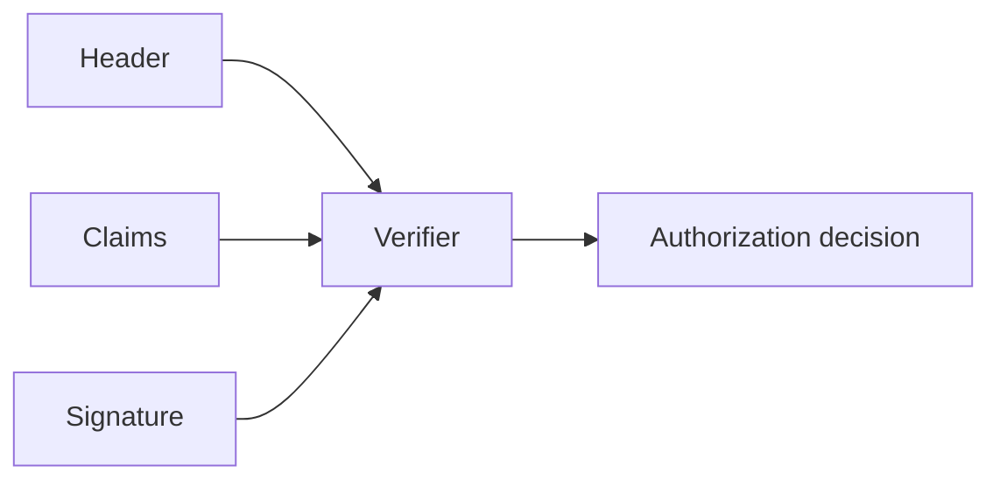
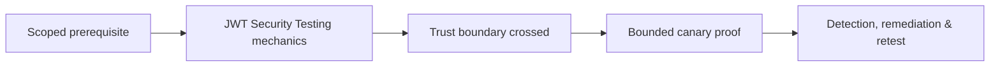

# JWT Security Testing

JWT is a serialization format, not an authorization system. Security depends on algorithm policy, key trust, claim validation, issuance, storage, revocation, and downstream use.



Test rejection of `alg:none`, algorithm confusion, weak HMAC secrets in canary fixtures, `kid` handling, JWK/JKU trust, embedded keys, key rotation, issuer, audience, subject, expiry, not-before, issued-at, token type, scope/role mapping, replay, refresh, and logout.

```json
{"iss":"https://idp.example.test","aud":"api","sub":"test-user","exp":1785409500,"role":"user"}
```

Alter one claim without a valid signature and confirm rejection. Do not crack production tokens. Remediate with fixed algorithm allowlists, trusted key sources, exact claim validation, short lifetimes, secure storage, refresh rotation, and server-side authorization independent of client claims.

Mastery lab: implement secure and flawed verifiers, rotate keys, test stale tokens, and show why Base64 decoding is not verification.

---
> 🔼 Up: [[Web Identity & Access Control]]

## Core Concept

**JWT Security Testing** is the atomic learning objective of this note. Identify its trust boundary, prerequisites, attacker-controlled input or state, vulnerable transformation, violated security invariant, minimum evidence, business consequence, and safe stopping point. The mechanism must remain explainable without depending on a specific product.

## Visual Attack Flow



## Practical Payloads & Execution

```http
POST /c2r-lab/jwt-security-testing HTTP/1.1
Host: app.example.test
Authorization: Bearer <CANARY_IDENTITY>
Content-Type: application/json

{"object":"C2R-CANARY","test":true}
```

### Expected output

```text
HTTP/1.1 200 OK
X-C2R-Result: vulnerable-condition-observed
{"marker":"C2R-CANARY-PROOF"}
```

Treat the output as proof of only the stated condition. Repeat with a negative control, preserve timestamps and the affected build, and never expand impact merely because another path appears reachable.

## Real-World Scenario

A multi-tenant enterprise service exposes a scoped **JWT Security Testing** condition to a synthetic customer account. The assessor proves one trust-boundary failure with a canary object, correlates application and identity telemetry, removes test state, and assigns the authoritative server-side control.

The durable remediation belongs at the authoritative enforcement layer. Retest the original condition and meaningful variants while verifying legitimate workflows still function.
