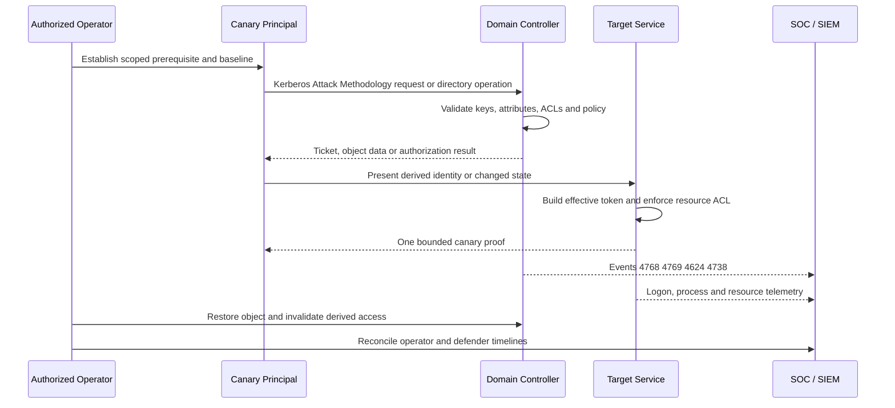

# Kerberos Attack Methodology

> [!warning] Authorized Active Directory simulation
> Use only signed scope, canary identities, designated hosts, synchronized UTC evidence, bounded proof, and tested rollback. Commands demonstrate attack execution, not installation or general tool documentation.

## Core Concept

Kerberos Attack Methodology must be understood as a state transition across directory objects, authentication messages, long-term keys, session material, access-control policy, and target-service authorization. A tool reports only one observation; mastery requires reconstructing who created the state, which component verified it, why the verifier accepted it, what effective token resulted, and which event invalidates the derived access.

### Low-level protocol and object mechanics

1. **ASN.1-DER.** Determine its binary or directory representation, controlling principal, verifier, authorization consequence, failure precondition, revocation behavior, and authoritative telemetry. Relate it to the preceding and following protocol state instead of treating it as an isolated label.
2. **AS-REQ.** Determine its binary or directory representation, controlling principal, verifier, authorization consequence, failure precondition, revocation behavior, and authoritative telemetry. Relate it to the preceding and following protocol state instead of treating it as an isolated label.
3. **PA-ENC-TIMESTAMP.** Determine its binary or directory representation, controlling principal, verifier, authorization consequence, failure precondition, revocation behavior, and authoritative telemetry. Relate it to the preceding and following protocol state instead of treating it as an isolated label.
4. **AS-REP.** Determine its binary or directory representation, controlling principal, verifier, authorization consequence, failure precondition, revocation behavior, and authoritative telemetry. Relate it to the preceding and following protocol state instead of treating it as an isolated label.
5. **TGT.** Determine its binary or directory representation, controlling principal, verifier, authorization consequence, failure precondition, revocation behavior, and authoritative telemetry. Relate it to the preceding and following protocol state instead of treating it as an isolated label.
6. **krbtgt.** Determine its binary or directory representation, controlling principal, verifier, authorization consequence, failure precondition, revocation behavior, and authoritative telemetry. Relate it to the preceding and following protocol state instead of treating it as an isolated label.
7. **etype.** Determine its binary or directory representation, controlling principal, verifier, authorization consequence, failure precondition, revocation behavior, and authoritative telemetry. Relate it to the preceding and following protocol state instead of treating it as an isolated label.
8. **TGS-REQ.** Determine its binary or directory representation, controlling principal, verifier, authorization consequence, failure precondition, revocation behavior, and authoritative telemetry. Relate it to the preceding and following protocol state instead of treating it as an isolated label.
9. **SPN.** Determine its binary or directory representation, controlling principal, verifier, authorization consequence, failure precondition, revocation behavior, and authoritative telemetry. Relate it to the preceding and following protocol state instead of treating it as an isolated label.
10. **service-ticket.** Determine its binary or directory representation, controlling principal, verifier, authorization consequence, failure precondition, revocation behavior, and authoritative telemetry. Relate it to the preceding and following protocol state instead of treating it as an isolated label.
11. **EncTicketPart.** Determine its binary or directory representation, controlling principal, verifier, authorization consequence, failure precondition, revocation behavior, and authoritative telemetry. Relate it to the preceding and following protocol state instead of treating it as an isolated label.
12. **PAC.** Determine its binary or directory representation, controlling principal, verifier, authorization consequence, failure precondition, revocation behavior, and authoritative telemetry. Relate it to the preceding and following protocol state instead of treating it as an isolated label.
13. **authenticator.** Determine its binary or directory representation, controlling principal, verifier, authorization consequence, failure precondition, revocation behavior, and authoritative telemetry. Relate it to the preceding and following protocol state instead of treating it as an isolated label.
14. **session-key.** Determine its binary or directory representation, controlling principal, verifier, authorization consequence, failure precondition, revocation behavior, and authoritative telemetry. Relate it to the preceding and following protocol state instead of treating it as an isolated label.

### Why the technique works

Cryptographic validity does not guarantee policy safety. Active Directory techniques frequently use protocols exactly as designed while exploiting an unsafe premise: weak key custody, an overbroad ACE, dangerous delegation, unbound challenge-response, a certificate template that lets the requester assert identity, or a trust whose resource ACL grants excessive reach. Write the acceptance equation explicitly: authenticated principal plus presented proof plus object state plus policy context produces an effective token. Then identify which term the operator can influence.

Separate reachability, authentication, authorization, and impact. A reachable LDAP or SMB service is not a finding. A valid ticket is not necessarily privilege. A graph edge is not proof until inheritance, deny ACEs, protected objects, ticket flags, signing, channel binding, target policy, and current object state are validated. Record the before-state, perform one reversible transition, capture server-side evidence, run a lower-privilege negative control, restore the object, and invalidate tickets, sessions, hashes, certificates, or caches.

## Visual Attack Flow



## Practical Payloads & Execution

The fictional forest corp.example and documentation addresses isolate the exercise. Preserve the exact command, executable hash and version, source host, UTC interval, object GUID or SID, client output, domain-controller evidence, and cleanup result.

```text
Rubeus.exe asreproast /domain:corp.example /format:hashcat /outfile:C:\Evidence\asrep.txt
impacket-GetUserSPNs -dc-ip 10.20.0.10 -request -outputfile tgs.txt 'corp.example/assessment.user:Canary-Only-Password!'
klist
```

### Expected terminal and server output

```text
[+] scoped domain: CORP.EXAMPLE
[+] authenticated principal: CORP\assessment.user
[+] canary prerequisite validated
[+] operation: Kerberos Attack Methodology
[+] result: C2R_CANARY_PROOF
[+] authoritative server event IDs: 4768 4769 4624 4738
[+] negative-control principal: ACCESS_DENIED
[+] cleanup: original state restored and derived access invalidated
```

Interpret output rather than trusting success text. Confirm the affected object or ticket from LDAP, the KDC, CA, target service, or endpoint. Stop after one synthetic object, group membership, file, ticket, certificate, policy application, or authentication proves impact. Never enumerate unrelated secrets because a primitive succeeds.

### Controlled execution sequence

1. Confirm source identity, destination, protocol, object and action are in scope.
2. Export the original attributes, security descriptor, policy, certificate state, ticket cache, or service configuration.
3. Verify prerequisites and defensive controls before execution.
4. Perform the minimum reversible action and timestamp it.
5. Capture both client output and authoritative server records.
6. Execute a negative control to prove the boundary.
7. Restore the exact original state and purge derived credentials.
8. Query again, compare hashes or attributes, and obtain system-owner confirmation.

## Real-World Scenario

An internal red-team assessment begins from an approved employee canary on a managed workstation. Enumeration identifies a candidate path involving ASN.1-DER, AS-REQ, and PA-ENC-TIMESTAMP. The team validates every prerequisite independently and rejects stale graph edges. It executes one reversible proof against a disposable identity or host, reaches one synthetic resource, and stops before collecting real credentials or changing production availability.

The SOC initially sees individually plausible authentication and administration. The detection opportunity appears only when events 4768 4769 4624 4738 are correlated by SID, LogonId, client address, service name, object GUID, changed attribute, process lineage and time. During purple-team replay, defenders preserve an independent timeline, identify missing audit policy or SACL coverage, and build an analytic around the protocol state change rather than a tool name.

A complete report explains the business boundary crossed, assumptions required, controls that succeeded, controls that failed, cleanup evidence, and the earliest durable remediation. Failed attack branches are retained as evidence of effective preventive controls.

## Detection Engineering & Hardening

Collect events 4768 4769 4624 4738 with required fields intact and forward them off-host. Enable directory-service changes, object access, account management, Kerberos, NTLM operational, certificate-service, policy and endpoint auditing where relevant. Baseline legitimate directory consumers and privileged workflows so high-volume LDAP, unusual encryption types, cross-domain tickets, delegated writes, certificate identity mismatches and abnormal network logons become distinguishable.

Remove the unsafe premise: minimize delegated rights, enforce tiered administration and protected workstations, use managed identities and strong AES keys, retire obsolete authentication, enforce SMB and LDAP signing plus channel binding, govern templates and trusts, rotate exposed secrets, monitor privileged object changes, and shorten credential lifetime. Retest the original path and adjacent variants while verifying required administration still functions.

## Crook2Root Mastery Checklist

- Explain every object, attribute, key, SID, ticket, token, ACE or certificate involved.
- Derive why the verifier accepts the proof logically or cryptographically.
- Execute one exact canary action and interpret realistic output.
- Correlate domain-controller, service, endpoint and network evidence.
- Restore every object and invalidate every derived credential.
- Define a negative test and durable remediation closure condition.

## Failure Analysis Matrix

Evaluate **Kerberos Attack Methodology** across four independent states. First, test **absence of the prerequisite**: the request must fail before any protected object or service is reached. Second, test **valid authentication with insufficient authorization**: the identity may be cryptographically genuine while the directory or resource ACL must deny the operation. Third, test **authorized canary execution**: the designated identity should succeed and produce the expected domain-controller and target-service events. Fourth, test **post-remediation behavior**: the original operator path and reasonable variants must fail while legitimate administration remains available.

Record protocol status codes, Kerberos or NTLM failure codes, LDAP result codes, affected DN and objectGUID, ticket flags, encryption type, SID set, access mask, certificate serial number, source address, LogonId, and UTC timestamps. A missing event is itself evidence of a telemetry gap, but only after verifying audit policy, SACL scope, collector health, DC selection, replication delay, and clock synchronization.

Classify the outcome precisely: **not reachable**, **not authenticated**, **authenticated but denied**, **authorized as designed**, **misconfigured and exploitable**, or **unable to verify**. This prevents scanner language or a successful tool message from replacing security reasoning. The final evidence package includes before-state, exact action, authoritative result, negative control, after-state, cleanup confirmation, detection query, remediation owner, and retest date.

---
> 🔼 Up: [[Active Directory & Identity Exploitation]]
